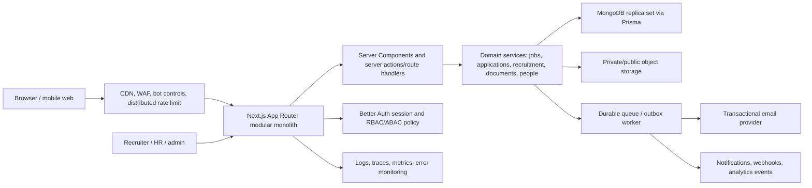

# Career Platform System Design and Repository Audit

**Audit date:** 2026-07-13  
**Target:** `career-portal/`  
**Legacy reference:** `mern/`  
**Scope:** public career site, candidate portal, recruiter/HR/admin workspaces, APIs, data, security, operations, testing, and production readiness.

## 1. Executive assessment

`career-portal` is much more than a company careers landing page. It is a substantial ATS/onboarding modular monolith with 36 pages, 57 API route handlers, and 16 primary Prisma models. It covers most features found in `mern` and improves several weak legacy security choices.

The application is suitable for continued staging work, but it is **not ready for production cutover**. The core business implementation is broad; the main gaps are production infrastructure, real end-to-end verification, candidate privacy/compliance, recruiter workflow depth, scalable job discovery, accessibility proof, and failure-state handling.

Approximate readiness by layer:

| Layer                          | Assessment                                                                         |
| ------------------------------ | ---------------------------------------------------------------------------------- |
| Legacy feature migration       | Strong, about 85–90% code coverage                                                 |
| Public career-site experience  | Good foundation, incomplete for a mature corporate careers site                    |
| Candidate application workflow | Functional, missing drafts/privacy/accessibility and some communication features   |
| Recruiter/ATS workflow         | Functional CRUD and status management, missing interviews/scorecards/collaboration |
| Security design                | Better than MERN, but production hardening remains                                 |
| Reliability/operations         | Incomplete                                                                         |
| Automated verification         | Good unit foundation, weak integration/E2E/visual/accessibility coverage           |
| Production readiness           | Not approved                                                                       |

## 2. Recommended full-stack Next.js system design

### Product actors

- Visitor: discovers the company, teams, locations, and open jobs.
- Candidate: applies, uploads documents, tracks status, responds to an offer, and completes onboarding.
- Employee/referrer: submits referrals and reviews.
- Recruiter/HR: manages jobs, candidates, workflow, offers, contracts, and certificates.
- Hiring manager/interviewer: reviews assigned candidates and submits scorecards.
- Administrator: manages users, permissions, policies, integrations, and audit records.
- Platform operator: monitors queues, delivery, security, data migrations, and incidents.

### Logical architecture



### Recommended domain boundaries

```text
src/
  app/
    (marketing)       company, culture, teams, locations, jobs
    (candidate)       account, applications, offers, onboarding
    (recruitment)     jobs, pipeline, candidates, interviews, reports
    (administration)  people, permissions, integrations, audit
    api/               webhooks, downloads, compatibility endpoints
  modules/
    identity/
    jobs/
    candidates/
    applications/
    interviews/
    offers/
    onboarding/
    referrals/
    notifications/
    compliance/
    analytics/
  lib/
    db/ auth/ queue/ storage/ email/ observability/ security/
```

### Data model additions recommended beyond the current schema

- `CandidateProfile`: canonical candidate identity, contact preferences, consent, and deduplication keys.
- `ApplicationDraft`: autosaved multi-step application state and upload references.
- `Interview`, `InterviewParticipant`, `InterviewFeedback`, `ScorecardTemplate`.
- `CandidateNote`, `CandidateTag`, `ApplicationActivity` timeline.
- `JobLocation`, `JobTeam`, `JobCategory`, `JobEmploymentPolicy`, `JobPostingWindow`.
- `SavedJob`, `JobAlert`, `TalentCommunityMember`.
- `ConsentRecord`, `DataSubjectRequest`, `RetentionPolicy`, `DeletionJob`.
- `WebhookEndpoint`, `WebhookDelivery`, `IntegrationCredential`.
- `AnalyticsEvent` or an external event sink with a documented schema.

### Primary request flows

1. **Job discovery:** CDN → server-rendered searchable jobs → indexed database/search service → structured `JobPosting` metadata.
2. **Application:** authenticated or verified-email candidate → autosaved draft → private direct upload → server validation → transactional application creation → outbox event → email/notification.
3. **Recruitment:** scoped recruiter query → pipeline/list → optimistic workflow mutation → activity/audit event → candidate communication.
4. **Interview:** recruiter schedules → calendar provider/webhook → participant notifications → structured scorecard → hiring decision.
5. **Offer/onboarding:** approved application → immutable offer snapshot → one-time response token → accepted offer → encrypted onboarding fields/private documents.
6. **Operations:** transaction commits business record + outbox → worker claims event → retries with dead-letter handling → metrics and alerting.

## 3. What is present in `career-portal`

### Public career experience

- Homepage with hero and approved employee reviews.
- Public jobs list, client search/filter/sort, job detail by slug or ObjectId.
- Contact form, metadata, robots, dynamic sitemap, canonical URLs, 404 page.
- Responsive public navigation and basic loading/error boundaries.
- Public certificate and offer verification with redacted projections.

### Candidate experience

- Registration, email verification through Better Auth, login/logout, password reset.
- Secure-cookie session instead of browser-authoritative JWT storage.
- Multi-step application with resume and custom application questions.
- PDF/DOCX resume parsing and autofill.
- Duplicate-application prevention and owned application tracking.
- Candidate application-status notifications.
- Offer accept/reject and encrypted contract-onboarding flow.

### Recruitment and documents

- Scoped dashboard statistics and recent applications.
- Job create/edit/delete, publication state, questions, image management, slugs.
- Application list/detail, resume access, answer files, status transitions, rejection/welcome actions.
- Offer issue, bulk import, PDF, email, extension, status, token rotation.
- Contract list/detail/status, protected document access, masked PDF.
- Certificate issue, bulk import, PDF, email, and verification QR.

### People, collaboration, and governance

- User and employee management with pagination.
- HR permission and assigned-job management.
- Employee recommendations and review moderation.
- User/admin notifications.
- Redacted audit-log UI.
- Server-side role, permission, account-status, and assigned-job enforcement.

### Platform foundation

- Next.js 16 App Router, React 19, strict TypeScript, Prisma/MongoDB, Zod.
- Domain-oriented server modules and focused client components.
- Health, liveness, and readiness endpoints.
- Request IDs, structured redacted logs, origin policy, security headers.
- Private Cloudinary uploads with signed access and bounded file checks.
- Email idempotency records and outbox event records.
- Backfill/auth migration scripts.
- Unit, schema, policy, parser, document, and public responsive smoke tests.

## 4. MERN versus Next.js comparison

| Capability                 | `mern`                                        | `career-portal`                                               | Result                                                   |
| -------------------------- | --------------------------------------------- | -------------------------------------------------------- | -------------------------------------------------------- |
| Architecture               | Separate Vite SPA + Express API               | One typed Next.js modular monolith                       | Next is simpler to deploy and reason about               |
| Rendering/SEO              | Client-rendered with React Helmet             | Server rendering, metadata API, sitemap/robots           | Next is stronger                                         |
| Sessions                   | localStorage/bearer JWT patterns              | HTTP-only Better Auth cookie sessions                    | Next is stronger                                         |
| Authorization              | Scattered middleware/UI guards                | Central policy plus route/service checks                 | Next is stronger                                         |
| Jobs/applications          | Present                                       | Present with typed schemas and server modules            | Parity largely present                                   |
| Documents/offers/contracts | Present                                       | Present with token and redaction improvements            | Next is stronger                                         |
| Employee/admin features    | Present                                       | Present with revised route groups                        | Parity largely present                                   |
| Public application         | Legacy backend exposes unauthenticated submit | Next requires a signed-in candidate                      | Intentional behavior difference; product decision needed |
| Password recovery          | OTP fields and legacy flow                    | Secure reset links                                       | Next is stronger                                         |
| Unknown routes             | Falls back to Home                            | Real 404                                                 | Next is correct                                          |
| Tests                      | No meaningful automated suite found           | 90 unit tests plus limited Playwright smoke/parity tests | Next is stronger but incomplete                          |
| Operations                 | Process-local limiter, console/custom logging | Still process-local limiter; adds health/outbox records  | Improved, not production-complete                        |

## 5. Missing or partial capabilities

### P0 — production blockers

1. **No distributed rate limiter.** The implementation explicitly uses an in-memory map and cannot coordinate across replicas/serverless isolates.
2. **No outbox consumer/worker.** Events are inserted, but no worker, claim loop, retry policy, dead-letter flow, or monitoring is implemented.
3. **No production CI/CD configuration.** No GitHub Actions, deployment manifest, preview gate, migration gate, or rollback automation is present.
4. **No production-like database migration rehearsal.** MongoDB replica-set compatibility, indexes, backfill duration, backup, restore, and rollback remain unproved.
5. **No provider integration proof.** SMTP, Cloudinary, reCAPTCHA, PDF/font, and token links need sandbox E2E tests.
6. **No external observability.** Logging is console JSON only; there is no error tracking, tracing, metrics, alerting, SLO, or runbook integration.
7. **Incomplete security hardening.** CSP permits `unsafe-inline` and `unsafe-eval`; admin MFA/SSO, secret rotation, upload malware scanning, and a formal threat model are absent.
8. **No privacy lifecycle.** There is no candidate consent record, retention schedule, export/delete request workflow, automated purge, or legal-text versioning.

### P1 — important product gaps

1. **Interview management is absent:** scheduling, calendars, interview panels, scorecards, feedback, and reminders.
2. **Recruiter collaboration is shallow:** no notes, mentions, tags, tasks, ownership, activity timeline, bulk actions, or saved views.
3. **Candidate communication is incomplete:** no configurable templates/campaigns, message history, application-submission email proof, preference center, or unsubscribe handling.
4. **Job discovery does not scale:** public jobs are loaded without pagination, full-text search, facets, counts, or a search index.
5. **Corporate careers content is thin:** no teams, locations, culture, values, benefits, employee stories, hiring-process, accommodation, or FAQ CMS.
6. **No job alerts, saved jobs, or talent community.** These are standard conversion/retention features for mature career sites.
7. **No job expiry/closing workflow.** The schema lacks application deadline, publish/unpublish timestamps, headcount, requisition ID, and archival rules.
8. **No candidate profile/deduplication layer.** Applications are the main record; cross-job candidate history and duplicate resolution are limited.
9. **No guest/low-friction apply option.** Requiring registration may reduce conversion; this should be an explicit product decision.
10. **No analytics funnel:** job view → apply start → step abandonment → submit → hire, source/UTM attribution, time-to-fill, and conversion reports.
11. **No integrations/webhooks:** HRIS, calendar, background checks, assessment tools, Slack/Teams, or external ATS export.

### P1 — correctness and UX gaps found in code

1. Public job queries catch every database error and return an empty list/null. A database outage can therefore look like “no jobs” or a false 404 instead of an operational error.
2. Only one `loading.tsx` and one `error.tsx` cover 36 pages. Recruitment/admin/candidate workspaces lack route-level loading and recovery states.
3. The application UI accepts DOC files and says 10 MB, while resume autofill supports only PDF/DOCX up to 5 MB. The copy is confusing even though final upload accepts DOC at 10 MB.
4. The application wizard has no draft persistence, refresh recovery, upload progress, or explicit final consent/privacy acknowledgement.
5. Tables are inconsistently responsive; several management tables rely on desktop layout without a dedicated mobile presentation.
6. Many screens use large headings, rounded cards, and repeated card grids; information density and workspace navigation need a production UI pass.
7. There is no `JobPosting` JSON-LD structured data on job detail pages.
8. Google fonts are fetched at build time; the audited build failed in the restricted environment when those downloads were unavailable. Self-hosting fonts would make builds deterministic.

### P2 — quality and maintainability gaps

1. Prettier check fails on 246 files.
2. No automated accessibility suite (`axe`), keyboard-flow suite, screen-reader review, or declared WCAG target.
3. Dual-app Playwright parity covers only four public routes and skips unless both environments are manually supplied.
4. No authenticated E2E coverage for apply, recruiter status flow, offer response, contract onboarding, admin permissions, or document access.
5. No API integration/contract tests against a real MongoDB replica set.
6. No visual regression snapshots or approved responsive baselines.
7. No load tests for job listing, resume parsing, bulk CSV, PDF generation, or application spikes.
8. Public jobs and several admin lists use fixed/unbounded result sets instead of cursor pagination.
9. No localization architecture; phone validation is hard-coded to ten digits and formatting is predominantly India-specific.
10. No documented browser/device support policy.

## 6. Quality-gate results from this audit

| Check                          | Result                                                                                                        |
| ------------------------------ | ------------------------------------------------------------------------------------------------------------- |
| ESLint (`pnpm lint`)           | Pass                                                                                                          |
| TypeScript (`pnpm typecheck`)  | Pass                                                                                                          |
| Unit tests (`pnpm test:unit`)  | Pass: 19 files, 90 tests                                                                                      |
| Prisma schema validation       | Pass                                                                                                          |
| Prettier (`pnpm format:check`) | Fail: 246 files                                                                                               |
| Production build               | Inconclusive in sandbox: failed because Google Fonts could not be downloaded; escalated retry was unavailable |
| Playwright                     | Not rerun; requires a built server/database and some tests require dual-app fixtures                          |

The existing migration report is stale in at least one measurable place: it states 37 unit tests, while the current suite contains 90 passing tests.

## 7. Prioritized implementation roadmap

### Phase 1 — make the current system safely deployable

- Add CI with lint, typecheck, format, unit, integration, build, and Playwright gates.
- Self-host fonts and make production builds network-independent.
- Add Redis/platform rate limiting and a durable outbox worker with DLQ and dashboards.
- Integrate error monitoring, traces, metrics, alerts, and health/runbook ownership.
- Rehearse production-like Mongo migration, index comparison, backup/restore, and rollback.
- Add provider sandbox tests and environment validation.
- Replace permissive CSP directives with nonce/hash-based policy where practical.
- Define privacy consent, retention, deletion/export, and audit requirements.

### Phase 2 — complete the candidate and recruiter workflows

- Add application drafts, upload progress, privacy consent, confirmation email, and recovery UX.
- Add interviews, calendar integration, scorecards, notes, activity timeline, ownership, tags, and bulk actions.
- Add cursor pagination and server-side search/filtering to jobs and high-volume admin lists.
- Add route-level loading/error/empty states and responsive mobile management views.
- Add authenticated E2E journeys and accessibility automation.

### Phase 3 — build a mature company careers product

- Add CMS-driven teams, locations, culture, benefits, stories, process, FAQ, and accommodations.
- Add saved jobs, job alerts, talent community, source attribution, and funnel analytics.
- Add `JobPosting` structured data and richer social previews.
- Add candidate profile/deduplication and recruiter reporting.
- Add webhooks and HRIS/calendar/assessment integrations.
- Add localization and region-aware validation.

## 8. Final recommendation

Keep the modular-monolith approach. It is appropriate for the present team and feature set and is cleaner than maintaining separate MERN frontend/backend deployments. Do not split into microservices yet. Introduce separate worker infrastructure only for asynchronous delivery, parsing, media processing, and integration events.

The next milestone should not be more surface-area features. It should be a **production-readiness release** that closes distributed operations, privacy, observability, deterministic builds, route failure states, and full critical-path E2E tests. After that, add interview/recruiter collaboration features and then expand the public careers experience.
