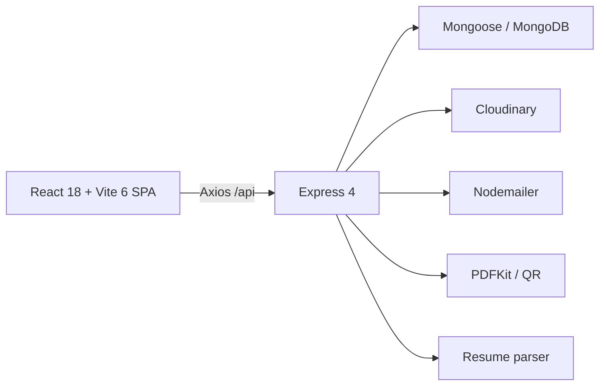

# 01 — Project Analysis

## Scope and constraints

Source of truth: `../../mern/` (read-only). Target: `career-portal/` (separate project). This assessment is static source analysis; no implementation or runtime parity claim is made.

## Existing architecture

The application combines a public careers site, candidate portal, employee portal, and HR/admin recruitment system.

### Frontend

- Entry: `mern/frontend/src/main.jsx`; root/router/providers: `src/App.jsx`.
- Providers: `HelmetProvider`, `BrowserRouter`, `ErrorBoundary`, `AuthProvider`; `NotificationProvider` exists but is not mounted.
- Styling: Tailwind CSS 3 plus `src/index.css`; an extensive compatibility layer remaps legacy dark/lime classes to white/emerald. `src/App.css` is ~13k lines of mostly dormant legacy theme CSS.
- State: local React state and `AuthContext`; no server-state library. A module `Map` provides short-lived jobs caching.
- API: centralized Axios clients in `src/services/api.js`, bearer JWT from `localStorage`.
- Runtime: lazy pages, Suspense loader, React Toastify, Framer Motion, React Helmet.

### Backend

- Entry: `mern/backend/api/index.js`; CommonJS Express application.
- Middleware: compression, manual security headers, in-process rate limiter, CORS, JSON parser, Mongo connection, routes, global error handler.
- Persistence: eleven Mongoose models, embedded documents, manual references and denormalized fields.
- Files: memory-based Multer uploads to Cloudinary.
- Email: multiple independently configured Nodemailer transports.
- Documents: PDFKit and QRCode for offer/certificate generation.
- Deployment: Vercel serverless or conventional Node listener.

## Application domains

1. Identity, OTP verification, password recovery, roles and permissions.
2. Public marketing, contact, jobs, reviews and SEO.
3. Job management and configurable questions.
4. Applications, resumes, question answers and status workflow.
5. Offers, acceptance, contracts and onboarding.
6. Certificates and document verification.
7. Users, employees, HR assignments and permissions.
8. Recommendations and employee reviews.
9. Notifications, dashboard statistics and audit logs.

## Current dependency concerns

- Frontend has no tests, TypeScript, canonical validation, query cache, or form framework.
- Backend has no tests, lint, typecheck or CI quality gate.
- `npm audit --omit=dev` during analysis reported 20 production dependency findings (2 critical, 12 high, 6 moderate), notably unused `textract` command-injection exposure and outdated mail/upload transitive dependencies.
- `node-cron`, AI SDKs, OCR/image packages and several frontend libraries appear unused.
- React runtime is 18 while frontend React type packages are 19.

## Important source inconsistencies

- Frontend calls `POST /api/contact`; backend has no contact route.
- Several frontend service methods have no backend route (application update/delete, certificate CRUD, alternate offer list, contract submission/upload aliases).
- Backend has routes unused by active UI (public application submit, job featured/search/filter/sort, token maintenance, admin notifications, portions of contract administration).
- HR is inferred inconsistently from role and department.
- `OfferLetter.contractId` references model name `Contract`, but actual model is `EmploymentContract`.
- Application recommendation query uses `under_review`; model enum uses `reviewing`.
- Contact/legal/profile/deep links include routes absent from `App.jsx`.

## Security findings not to reproduce

- Registration accepts caller-supplied privileged role.
- JWT is authoritative in `localStorage`; the HTTP-only cookie is set but not read by auth middleware.
- Suspended/inactive users remain authenticatable.
- OTPs use `Math.random`, are stored plaintext, logged, and lack attempt throttling.
- Offer acceptance/rejection and contract upload do not enforce the generated acceptance token.
- Public acceptance lookup can expose a complete contract including sensitive PII/banking data.
- Application answer update lacks ownership authorization.
- HR assignment checks are missing from several sensitive application operations.
- Public/weakly authorized downloads and fuzzy suffix lookups expose document metadata.
- Upload validation relies on extension/MIME and has no malware scanning.

## Target architecture direction

Use a Next.js 16 modular monolith with React Server Components by default, domain modules, Prisma MongoDB, Better Auth, Zod at every trust boundary, TanStack Form for complex forms, TanStack Query only for interactive server state, and scoped Zustand stores for client-only state. Preserve required HTTP contracts through Route Handlers. Keep business logic in server-only domain services rather than components or giant handlers.

## Analysis limitations

Static source establishes intended code behavior, not production data shape or runtime behavior. Before schema finalization, perform read-only live-data profiling for collections, indexes, BSON types, enum drift, duplicate identifiers, dangling references, hash formats and relation disagreements. Before marking parity, run both applications against deterministic fixtures as specified in `15-test-parity-plan.md`.
