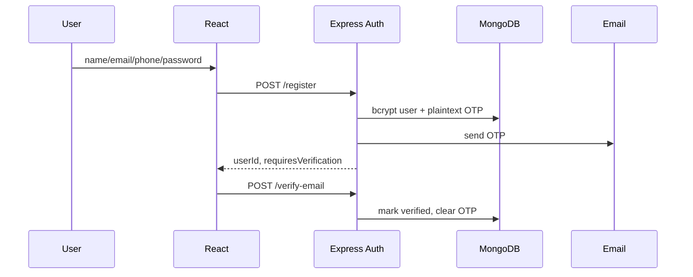

# 07 — Authentication Flow Map

## Existing transport

1. Login returns JWT `{userId, role}` and user JSON; backend also sets an HTTP-only cookie.
2. Frontend stores JWT and user in `localStorage` and sends `Authorization: Bearer` through Axios.
3. Backend auth middleware reads only bearer headers, so the cookie is ineffective.
4. Frontend decodes expiry, polls validity, syncs storage events and calls `/api/auth/me`.
5. Any Axios 401 clears local state and hard-redirects to login.
6. Frontend logout clears local state but does not call backend logout; server logout only clears the unused cookie.

## Existing registration and verification

Critical defect: registration accepts caller `role`, including privileged values. Email is not normalized. OTP uses `Math.random`, is logged/plaintext and has no attempt control.

## Login rules

- Name/email/password presence is minimally validated.
- User must be email-verified.
- bcrypt compare with cost-10 hash.
- Account status is not checked, so inactive/suspended/former users may log in.
- “User not found” and bad password differ, enabling enumeration.
- JWT defaults to one day; no refresh/revocation/version/issuer/audience policy.

## Recovery

Forgot password stores a six-digit plaintext OTP for ten minutes and reveals missing accounts. Reset bcrypt-hashes new password but does not revoke existing JWTs. No strength policy or attempt/cooldown limit exists.

## Existing authorization inputs

- Roles: user, employee, admin, super-admin.
- HR inferred from department/legacy role with frontend/backend disagreement.
- Status: active, inactive, former, suspended.
- Nine permissions under `permissions.can*`.
- `assignedJobs[]` for HR scope.
- Guards/middleware: authenticated, admin, super-admin, HR, permission, job assignment, employee/review eligibility.

## Target Better Auth flow

- Secure server-managed session cookie; no authoritative token in localStorage.
- Better Auth Mongo/Prisma adapter compatible with existing ObjectIds.
- Reuse existing users and migrate bcrypt hashes to credential Account records using custom bcrypt verification; optionally progressive rehash.
- Registration always assigns candidate role server-side.
- Centralized helpers: `requireUser`, `requireRole`, `requirePermission`, `requireJobAssignment`, `requireOwnership`.
- Enforce account status on login and every sensitive session use.
- Server-only privilege fields; never accepted from public profile payloads.
- Generic auth/recovery responses, cryptographic tokens, hashing, expiry, attempt limits and endpoint-specific rate limits.
- Session rotation/revocation after password reset, suspension and privilege changes.
- Email verification and reset delivered by one mail adapter with idempotency.

## Cutover decisions

- Existing JWTs cannot automatically become Better Auth sessions. Choose documented hard re-login or a time-limited bridge.
- Existing OTP records cannot directly become Better Auth verification records; invalidate and require resend.
- Current seeded passwords can be shorter than Better Auth defaults; select temporary compatibility minimum or documented reset path.
- Decide whether admin bypasses granular permissions; current code always bypasses.
- Canonicalize HR definition and employee/account statuses before implementation.

## Required auth tests

Registration privilege escalation; duplicate/case-variant email; verification expiry/resend/attempts; login states; suspended/inactive/former behavior; logout/session revocation; cross-tab expiry; password-reset revocation; CSRF/cookie flags; open redirect; role/permission changes mid-session; every role/permission/assignment negative case. No auth feature is verified yet.
