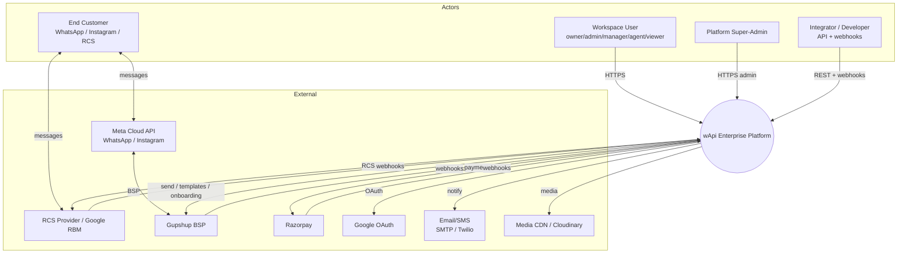
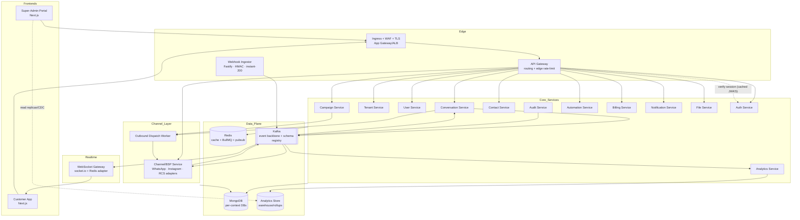
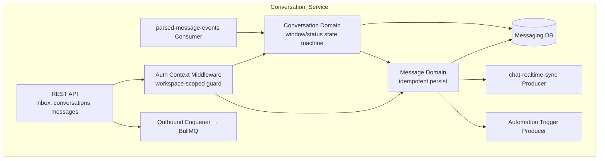
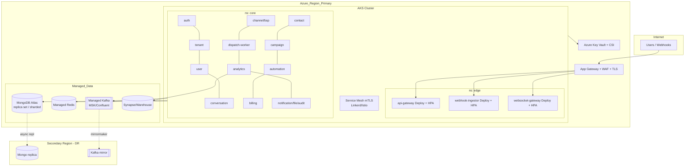
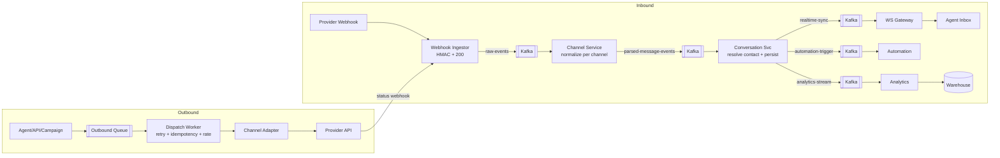
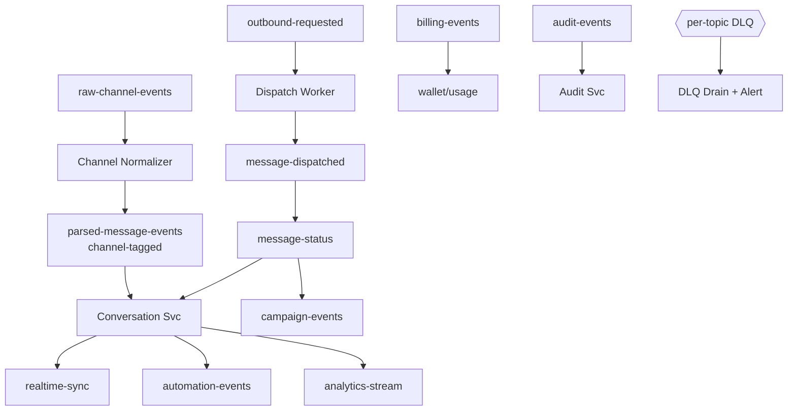

# wApi — Target Enterprise Architecture (Future State)

> Designed as an evolution of the **existing** codebase, not a rewrite. The current event-driven messaging seam, `@wapi/contracts`, the BSP abstraction, and the separate admin realm are kept and hardened. New elements address the gaps surfaced in the current-state, infrastructure, and security analyses.

**Target product scope:** Multi-tenant SaaS · WhatsApp Business API · Instagram Messaging · RCS · Omnichannel Inbox · Campaigns · Automation Builder · Template Management · Analytics · Billing · Team Management · Super-Admin Portal.

**Guiding principles**
1. Keep the clean seams (inbound Kafka pipeline, campaign saga, BSP dispatch); fix the coupled ones (shared DB, god-auth-service, sync outbound).
2. Channel-agnostic core: `ProviderApp` + `ParsedMessageEvent` already abstract the channel — generalize to WhatsApp/Instagram/RCS.
3. One writer per aggregate; cross-service reads via API or CDC read-models, never shared schemas.
4. Async by default for provider I/O; sync only for user-blocking reads.
5. Zero hardcoded secrets; tenant isolation enforced at the framework layer.

---

## 1. C4 Level 1 — System Context

---

## 2. C4 Level 2 — Container Diagram

**Key container changes vs today**
- **Auth split** into Auth (sessions/JWT/JWKS), Tenant (workspaces/plans/policy), User (profiles/teams/RBAC). Auth verification uses **stateless JWKS-verified JWTs** at the gateway (no per-request HTTP fan-out; revocation via short TTL + Redis denylist).
- **Outbound Dispatch Worker** added — all sends become async jobs with retry + idempotency; agent UI is no longer blocked on the BSP.
- **Channel/BSP Service** generalizes today's `service-provider` into a multi-channel adapter (WhatsApp/Instagram/RCS), preserving `ProviderApp`/`ParsedMessageEvent`.
- **Analytics Service + warehouse** consume the event stream; dashboards stop hitting OLTP.
- **Audit Service** owns `audit-events` (moved out of auth).
- **File Service** owns media upload/scan/CDN (today scattered in service-provider/Cloudinary).

---

## 3. C4 Level 3 — Component Diagram (Conversation Service, representative)

Mirrors today's chat-service responsibilities (`chat-service/src/services/kafkaService.ts`, `controllers/chatController.ts`) but replaces the **sync** outbound call with `OUTQ` (BullMQ) and keeps the inbound consumer + realtime producer.

---

## 4. C4 Level 4 — Deployment Diagram (Kubernetes / Azure target)

Per-service: Deployment + HPA (CPU/mem + custom Kafka-lag metric for consumers/workers), PodDisruptionBudget, readiness/liveness probes (extend existing `/health`), resource requests/limits (today's `--max-old-space-size` caps map directly), and Key Vault CSI-mounted secrets.

---

## 5. Data Flow Diagram (target)

Single inbound ingress (ingestor only), async outbound queue, analytics tee — the three message-flow fixes.

---

## 6. Event Flow Diagram (target topics)

**Envelope standard (new):** every event carries `{ eventId, eventType, eventVersion, occurredAt, workspaceId, correlationId, causationId, channel, payload }`; partition key = `workspaceId` for ordering; validated against a **schema registry** on consume. Extends today's `@wapi/contracts` shapes with version + envelope.

---

## 7. Multi-Tenancy Model (target)

- **Tenant = Workspace** (unchanged). Every request carries a verified `workspaceId`; every query is workspace-scoped via a **framework-level guard** (a shared middleware/Mongoose plugin that *refuses* un-scoped queries on tenant collections) rather than ad-hoc `.find({workspace})`.
- **Isolation tiers:** (1) shared cluster + row-level `workspace` filter (default), (2) dedicated DB for large/enterprise tenants, (3) dedicated namespace/cluster for regulated tenants — selectable per plan.
- **Noisy-neighbor controls:** per-workspace quotas/rate-limits enforced at gateway + dispatch worker (token bucket in Redis), plan-driven from Billing.

---

## 8. Channel Abstraction (omnichannel)

Generalize `ProviderApp`/`ParsedMessageEvent`/`ProviderMessageDispatch` (today WhatsApp-only) into a `Channel` interface with adapters:

| Capability | WhatsApp (exists) | Instagram (new) | RCS (new) |
|---|---|---|---|
| Onboarding | Gupshup partner flow (`onboarding.service.ts`) | Meta IG login + page link | RBM brand/agent registration |
| Inbound normalize | `extractV3Messages/Statuses` (`webhooks.service.ts`) | IG webhook → same `ParsedMessageEvent` | RBM webhook → same |
| Outbound | `GupshupClientService.sendMessage` | IG Send API | RBM send |
| Templates | `bsp_template_mirrors` | IG has none (free-form in window) | RCS rich cards/suggested replies |
| Session window | 24h | 24h (IG) | per-RCS rules |

The empty `channels/insta` and `channels/rcs` dirs become real adapters implementing the same port. `Conversation.channel` already exists (`contracts/models.ts:150`) — make it authoritative.

---

## 9. What Is Kept vs Changed

| Area | Keep | Change |
|---|---|---|
| Inbound pipeline | webhook→Kafka→normalize→conversation→realtime | collapse double ingress; add analytics tee |
| Outbound | BSP dispatch + ProviderMessageDispatch record | make async via queue + retry + idempotency |
| Campaign saga | budget reserve/settle pattern | distributed rate-limit; bulk contact read-model |
| Contracts | `@wapi/contracts` central types | add event envelope + versioning + runtime validation |
| Auth | separate admin realm, RBAC permission maps | split auth/tenant/user; stateless JWKS verify |
| Realtime | socket.io + Redis adapter | keep; remove DB lookups on fan-out |
| Data | per-context intent | enforce DB-per-context; single writer; CDC read-models |
| Infra | wapi-runner for dev | add containers + K8s + CI/CD + observability + secrets mgr |
| Channels | ProviderApp abstraction | implement Instagram + RCS adapters |
