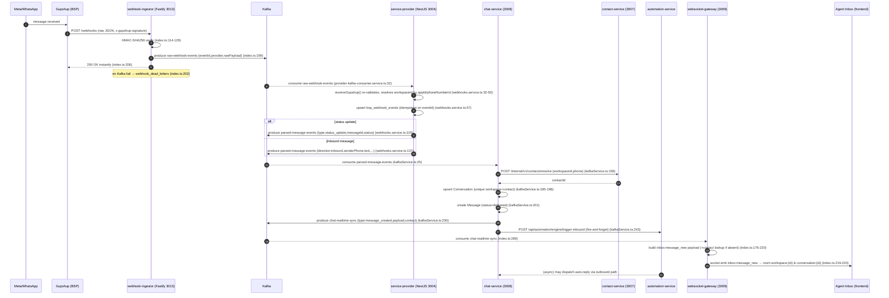
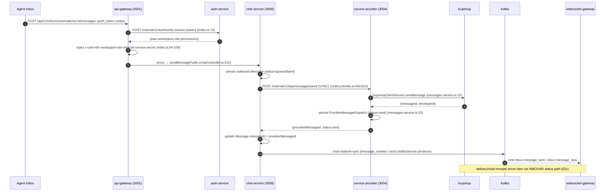
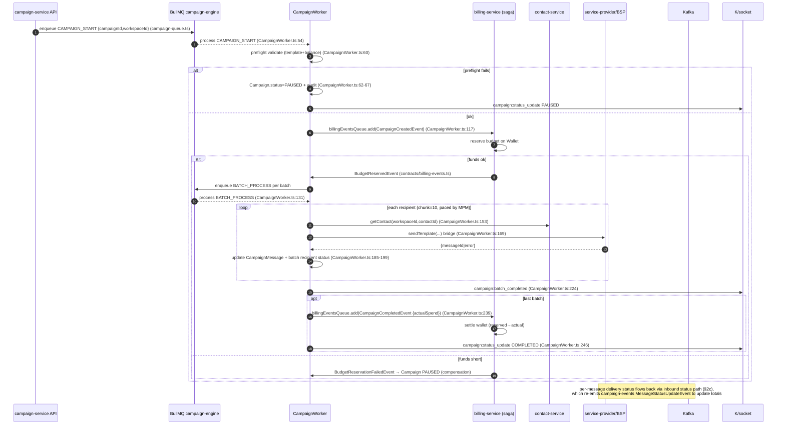

# ConnectSphere — Message Flow Analysis

> Traced end-to-end from source. Sequence diagrams use Mermaid. Every step cites the file/line that implements it. Two inbound paths exist and both are documented; the duplication is flagged.

---

## 1. Topic & Queue Map

| Channel | Name | Transport | Producer(s) | Consumer(s) |
|---|---|---|---|---|
| Kafka | `raw-webhook-events` | kafkajs | webhook-ingestor (`index.ts:199`), service-provider `channel.service.ts:97,122` | service-provider `ProviderKafkaConsumerService` (`provider-kafka-consumer.service.ts:32`) |
| Kafka | `parsed-message-events` | kafkajs | service-provider `webhooks.service.ts:105,137` | chat-service (`kafkaService.ts:25`) |
| Kafka | `chat-realtime-sync` | kafkajs | chat-service (`kafkaService.ts:115,230`) | websocket-gateway (`index.ts:289`), billing-service (`EventBus.ts:109`) |
| Kafka | `campaign-events` | kafkajs | chat-service (status, `kafkaService.ts:135`), campaign-service | campaign-service `EventBus.ts:240`, websocket-gateway |
| Kafka | `billing-events` | kafkajs | billing-service | billing-service consumer, websocket-gateway |
| Kafka | `contact-events` | kafkajs | contact-service | websocket-gateway |
| Kafka | `automation-events` | kafkajs | automation-service | websocket-gateway |
| Kafka | `audit-events` | kafkajs | admin/auth actions | auth-service consumer → `auditlogs` |
| BullMQ | `campaign-engine` | Redis | campaign-service (`campaign-queue.ts`) | `CampaignWorker` (`workers/CampaignWorker.ts:21`) |
| BullMQ | billing saga queue (`billingEventsQueue`) | Redis | campaign worker (`CampaignWorker.ts:117,239`) | billing-service saga handler |
| Redis pub/sub | socket.io redis-adapter | Redis | websocket-gateway | websocket-gateway (multi-instance fan-out, `index.ts:368`) |
| HTTP (sync) | `/internal/v1/bsp/messages/send` | fetch/axios | chat-service, campaign worker | service-provider `MessagesService` |
| HTTP (sync) | `/internal/v1/contacts/resolve` | fetch | chat-service | contact-service |
| HTTP (sync) | `/api/automation/engine/trigger-inbound` | fetch (fire-and-forget) | chat-service | automation-service |

**Resilience:** every Kafka consumer does 3 attempts w/ exponential backoff then publishes to `{topic}-dlq` (`chat/kafkaService.ts:32-72`, `websocket/index.ts:298-344`, `provider-kafka-consumer.service.ts:39-86`). The ingestor instead persists to Mongo `webhook_dead_letters` with a `/internal/v1/webhooks/replay` endpoint (`webhook-ingestor/src/index.ts:73-92,217-248`).

---

## 2. Inbound Message Lifecycle

### 2a. Canonical path (current production-intended)



### 2b. Direct path (also present — duplication)

`service-provider` also exposes a **direct HTTP webhook controller** (`webhooks.controller.ts`) that calls the *same* `receiveGupshup()`. So a Gupshup webhook can reach the parser **either** via the ingestor→Kafka hop **or** directly. (Source: `provider-kafka-consumer.service.ts:56` and the controller both invoke `webhooksService.receiveGupshup`.) Idempotency on `bsp_webhook_events.eventId` (`webhooks.service.ts:57`) prevents double-persist, but **`parsed-message-events` can still be produced twice** if both paths fire for the same delivery, since the produce step is unconditional after the upsert. **→ Flagged: collapse to one canonical ingress.**

### 2c. Status-update sub-flow (delivery receipts)

```mermaid
sequenceDiagram
    autonumber
    participant SP as service-provider
    participant K as Kafka
    participant CS as chat-service
    participant CMP as campaign-service
    participant WS as websocket-gateway
    SP->>K: parsed-message-events {type:status_update, messageId, status} (webhooks.service.ts:105)
    K-->>CS: consume (kafkaService.ts:88)
    CS->>CS: Message.findOne({workspace,messageId}); updateStatus(status) (kafkaService.ts:91-97)
    CS->>K: chat-realtime-sync {type:message_status_updated} (kafkaService.ts:115)
    alt message belongs to a campaign
        CS->>K: campaign-events {MessageStatusUpdateEvent} (kafkaService.ts:135)
        K-->>CMP: update CampaignMessage status / totals
    end
    K-->>WS: chat-realtime-sync → inbox:message_status (index.ts:226-236)
    WS->>WS: emit inbox:message_status to workspace+conversation rooms
```

Status mapping (`webhooks.service.ts:213-231`): `enqueued|accepted|sent→sent`, `delivered→delivered`, `read|seen→read`, `failed|deleted→failed`.

---

## 3. Outbound Message Lifecycle

### 3a. Agent-initiated send (inbox)



**Key property:** the agent's request **blocks on the Gupshup round-trip** (`chatController.ts:438-441`). There is no outbound queue — burst load and provider latency propagate straight to the agent UI (bottleneck B2 in current-state).

### 3b. Campaign broadcast (saga)



Pacing: `agentMessagesPerMinute/60` messages/sec, chunked at concurrency 10, `setTimeout` between chunks (`CampaignWorker.ts:144-208`). Worker concurrency is 5 (`CampaignWorker.ts:23`).

---

## 4. Realtime Fan-out Detail

`websocket-gateway` authenticates the socket by verifying the `auth_token` JWT itself (`index.ts:63-91`), then checks workspace membership against the `permissions` collection before joining `workspace:{id}` / `conversation:{id}` rooms (`index.ts:101-139`). It consumes 5 Kafka topics and maps them to socket events (`index.ts:253-274`). A Redis adapter (`@socket.io/redis-adapter`) lets multiple gateway instances share rooms (`index.ts:360-373`). Multi-name emits (e.g. both `inbox:message_new` and legacy `message:created`) provide frontend back-compat (`index.ts:219-223`).

---

## 5. Analytics Path

Analytics is **not a separate pipeline today**. The gateway routes `/api/v1/analytics` and `/api/v1/metrics` to **chat-service** (`api-gateway/src/index.ts:341-342`), which computes them live from `messages`/`conversations` (`chat-service/src/controllers/supportController.ts` `getMessageTrends`). The super-admin snapshot aggregates counts directly (`control-plane-service.ts`). There is **no event-sourced analytics store, no rollups, no warehouse**. The `audit-events` topic is the closest thing to an analytics stream and only feeds `auditlogs`.

---

## 6. Failure Modes & Gaps (message layer)

| # | Gap | Evidence | Consequence |
|---|---|---|---|
| M1 | Two inbound ingress paths can double-produce `parsed-message-events` | §2b | Possible duplicate inbound messages if both fire (mitigated only by downstream `messageId` unique on persist) |
| M2 | Outbound send is synchronous, no queue | `chatController.ts:438` | Agent latency = provider latency; no burst absorption; no retry on transient BSP failure |
| M3 | Kafka optional in non-prod | `kafkaService.ts:77-83` etc. | Locally the whole realtime/inbound pipeline can be silently dead |
| M4 | DLQs exist but no DLQ consumer/alerting | grep: `{topic}-dlq` produced, no subscriber | Dead letters accumulate unmonitored |
| M5 | Status event reshaped at each hop; field-name tolerance | `websocket/index.ts:228` | Brittle; a shape change breaks status display silently |
| M6 | Campaign per-recipient contact fetch over HTTP | `CampaignWorker.ts:153` | Network N+1; throughput ceiling |
| M7 | No idempotency key enforced end-to-end on outbound | `BspSendMessageRequest.idempotencyKey` optional (`contracts/bsp.ts:90`) | Retries could double-send |
| M8 | No global ordering / partition key discipline documented | producers key by messageId/conversationId variably | Out-of-order status vs create possible |

---

## 7. Recommended Target Message Flow (preview — see future-state.md)

1. **Single ingress:** ingestor is the *only* webhook edge → `raw-webhook-events`; service-provider consumes Kafka **only** (remove the direct controller produce). One canonical normalizer.
2. **Outbound queue:** chat/campaign enqueue an `outbound-messages` job; a dispatch worker calls BSP with retry + idempotency key; agent UI gets optimistic ack + async status. Decouples agent latency from provider.
3. **DLQ pipeline:** a dedicated consumer drains `{topic}-dlq` → Mongo + alert, with replay tooling (generalize the ingestor's existing replay).
4. **Event envelope + schema registry:** version every event; validate on consume; partition by `workspaceId` for ordering.
5. **Analytics stream:** tee `parsed-message-events` + `chat-realtime-sync` into a rollup/warehouse so dashboards never touch OLTP.
