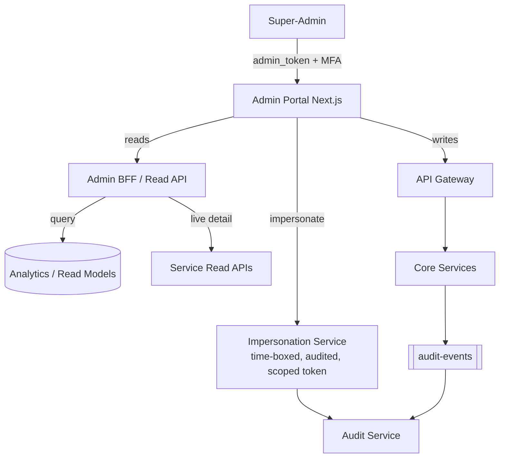

# ConnectSphere — Super-Admin Platform Design

> The Super-Admin Portal **already exists** as `apps/admin-portal` (Next.js, port 3100) with its own auth realm, RBAC capability model, and feature pages. This document describes what is built (cited), the gaps, and the target design.

---

## 1. What Exists Today

### Separate identity realm
- Dedicated `admin_token` cookie (default name `admin_token`, 8h TTL), entirely separate from the customer `auth_token` (`apps/admin-portal/src/server/auth.ts:26-27`).
- Login verifies email+password against the **core `User` collection** but rejects any non-admin role (`auth.ts:82-98`). Uniform failure to prevent enumeration (`auth.ts:88`).
- Four platform roles with a capability matrix in `@connectsphere/contracts` (`packages/contracts/src/admin.ts`):
  - `super_admin` → all capabilities.
  - `super_admin_readonly` → `read`.
  - `super_admin_support` → `read, workspaces, users, operations`.
  - `super_admin_finance` → `read, billing, operations`.
  - Enforced by `adminCan(role, capability)` and `requireAdmin(capability)` guard (`auth.ts:164-171`).

### Data access pattern (Rule #4)
- **Reads go direct to MongoDB**; **writes go through the API Gateway.** (`CLAUDE.md` Conventions; `apps/admin-portal/src/server/db.ts`, `gateway-client.ts`.)
- The portal opens **4 separate DB connections** (core/billing/campaign/automation) via `getConnection()` (`db.ts:14-91`).

### Feature pages (built — `apps/admin-portal/src/app/(dashboard)/`)
`analytics`, `audit-logs`, `billing`, `compliance`, `data-explorer`, `entitlement-drift`, `gupshup`, `monitoring`, `operations`, `settings`, `users`, `whatsapp-requests`, `workspaces` (+ `workspaces/[id]`).

### Server operations (`apps/admin-portal/src/server/` + `app/api/admin/`)
- **Read APIs** (`app/api/admin/read/*`): dashboard, workspaces, users, billing(+stats), invoices, plans, analytics, audit-logs, compliance, monitoring, operations, gupshup(+health), webhook-status, entitlement-drift, whatsapp-requests, data (collections/documents).
- **Ops/write APIs** (`app/api/admin/ops/*`): workspaces `[id]/[action]`, users `[id]/[action]` + invite, billing `[action]`, gupshup `[action]`, **impersonate `[workspaceId]`**, operations `[action]`, compliance, data/document, settings, repair.
- **Control-plane snapshot** built server-side in auth-service (`super-admin/control-plane-service.ts`): workspace/user counts, 30-day message count, connected-WhatsApp count, pending onboarding, mapped/orphaned Gupshup apps, plan distribution, billing gross revenue (via billing `/admin/stats`), BSP health, verification policy, maintenance mode.

### Impersonation
- An `impersonate/[workspaceId]` ops route plus `x-impersonating` header propagated by the gateway (`api-gateway/src/index.ts:100`) and surfaced through `verifySession` (`isImpersonating` from `decoded.isImpersonating`, `authController.ts:894`). `IMPERSONATION_COOKIE_DOMAIN` env exists (`admin-portal/.env.example`).

### Platform controls
- **Maintenance mode**: `SystemSettings.maintenanceMode` blocks all non-super-admin sessions with 503 at verify-session (`authController.ts:880-886`).
- **Business verification policy** (global mandatory toggle) (`BusinessVerificationPolicy`, `business-verification-policy-service.ts`).
- **Webhook policy** (global/workspace/app scopes) (`auth-service/models/index.ts:361-415`).
- **Audit trail** via `audit-events` Kafka → `auditlogs` (90d TTL).

---

## 2. Gaps in the Current Super-Admin

| # | Gap | Evidence | Risk |
|---|---|---|---|
| G1 | Direct multi-DB reads couple the portal to 4 service schemas | `db.ts:14-21` | Schema drift breaks admin; bypasses service invariants |
| G2 | Admin shares `JWT_SECRET` with all services | `auth.ts:29-33` | A leaked platform secret forges both realms |
| G3 | Impersonation lacks a visible, immutable audit + time-box in code seen | only header + route | Privilege-escalation blind spot |
| G4 | No MFA on admin login | password-only (`auth.ts:74-111`) | High-value accounts under-protected |
| G5 | Revenue/analytics computed by live aggregation | `control-plane-service.ts:54-83` (unindexed `messages` scan) | Dashboard slow/expensive at scale |
| G6 | Capability model is coarse (7 capabilities) | `admin.ts` | Hard to grant least-privilege for support workflows |
| G7 | Writes-through-gateway but reads-direct means **read/write models can disagree** | Rule #4 | Admin sees stale/inconsistent state |

---

## 3. Target Super-Admin Architecture

**Principles**
1. **Reads via Analytics/read-models + service read-APIs**, not raw cross-service DB connections (closes G1/G7). Keep `data-explorer` as a *break-glass*, audited, super_admin-only raw query tool.
2. **Separate admin signing key** (own JWKS / key id) so the admin realm can be revoked independently (closes G2).
3. **MFA mandatory** for all admin roles (closes G4).
4. **Impersonation as a first-class, time-boxed, fully-audited capability** with a distinct scoped token, banner in customer UI, auto-expiry, and an immutable `USER_IMPERSONATION` audit event (already an `AuditEventAction` in `contracts/kafka-events.ts:104`) — enforce it end-to-end (closes G3).
5. **Fine-grained capabilities** beyond today's 7 (e.g. `billing:refund`, `workspace:suspend`, `waba:reassign`, `data:read`, `data:write`) with role bundles (closes G6).

---

## 4. Feature Modules (target, mapped to existing pages)

### 4.1 Tenant Management 🟢→🟡
- List/search workspaces, drill-down (`workspaces/[id]`), plan/limits, onboarding status, WhatsApp connection state, suspend/restore, delete (with `WORKSPACE_DELETE` audit). Today: `read/workspaces`, `ops/workspaces/[id]/[action]`.
- **Add:** lifecycle state machine (trial→active→past_due→suspended→churned), bulk actions, entitlement override with drift detection (page `entitlement-drift` exists).

### 4.2 Revenue Dashboard 🟡
- Gross revenue, plan distribution, recharge volume, MRR/ARR, churn. Today partial via `control-plane-service.ts` + billing `/admin/stats`.
- **Add:** sourced from **Analytics/warehouse** (not live OLTP scans); cohort/retention; per-plan revenue; refund/dispute view.

### 4.3 Subscription Control 🟡
- View/change plan, apply credits, comp/trial extension, dunning state. Today: `read/plans`, `read/billing`, `ops/billing/[action]`.
- **Add:** plan CRUD as the single Plan owner (Billing), entitlement push to Tenant via `plan.changed`.

### 4.4 WABA / Channel Management 🟢→🟡
- Gupshup app health, mapped/orphaned apps, reassign WABA, phone numbers, webhook status. Today: `read/gupshup`, `read/gupshup-health`, `ops/gupshup/[action]`, `read/webhook-status`, `whatsapp-requests`.
- **Add:** per-app circuit-breaker/health from Channel Svc and token-expiry alerts (BspHealth already modeled).

### 4.5 User Management 🟢
- List/search platform-wide users, role/status change, invite admins, force-logout, delete. Today: `read/users`, `ops/users/[id]/[action]`, `ops/users/invite`.
- **Add:** MFA reset, session list, impersonation entry point with audit.

### 4.6 Support Center 🟡
- Cross-tenant conversation/ticket lookup (read-only), macro/quick-reply templates, impersonation for live assist. Today: `support_support` capability + impersonation route.
- **Add:** scoped, time-boxed impersonation; redaction controls for PII.

### 4.7 Audit Logs 🟢
- Filter by actor/action/resource/time. Today: `read/audit-logs` + `auditlogs` (90d TTL, `audit-events` consumer).
- **Add:** WORM export before TTL, tamper-evidence (hash chain), `USER_IMPERSONATION` prominence.

### 4.8 Platform Analytics 🟡
- Tenants, messages, campaigns, automation usage, system health, consumer lag, DLQ depth. Today: `read/analytics`, `read/monitoring`, `read/operations`.
- **Add:** from Analytics Svc; SLOs; alerting; Kafka/queue health (today none).

### 4.9 Compliance & Operations 🟢→🟡
- Compliance page, data-explorer (break-glass), repair operations, emergency freeze (`SECURITY_EMERGENCY_FREEZE` audit action exists, `kafka-events.ts:112`), maintenance mode, broadcast notice, system settings. Today: `compliance`, `data-explorer`, `ops/repair`, `ops/operations/[action]`, `settings`.
- **Add:** maker-checker (dual-control) for destructive ops; per-action capability gates.

---

## 5. Super-Admin RBAC (target capability matrix)

| Capability | super_admin | finance | support | readonly |
|---|---|---|---|---|
| `read` (dashboards) | ✓ | ✓ | ✓ | ✓ |
| `workspace:read` | ✓ | ✓ | ✓ | ✓ |
| `workspace:suspend/restore` | ✓ | | ✓ | |
| `workspace:delete` | ✓ | | | |
| `user:read` | ✓ | ✓ | ✓ | ✓ |
| `user:write/invite` | ✓ | | ✓ | |
| `billing:read` | ✓ | ✓ | ✓ | ✓ |
| `billing:adjust/refund` | ✓ | ✓ | | |
| `waba:read` | ✓ | | ✓ | ✓ |
| `waba:reassign` | ✓ | | ✓ | |
| `impersonate` (time-boxed) | ✓ | | ✓ | |
| `data:read` (explorer) | ✓ | | | |
| `data:write` (repair) | ✓ (maker-checker) | | | |
| `system:maintenance/freeze` | ✓ (maker-checker) | | | |
| `audit:read` | ✓ | ✓ | ✓ | ✓ |

Extends today's `adminCan` (`packages/contracts/src/admin.ts`) — same single-source-of-truth pattern, finer capabilities, plus dual-control flag on destructive ones.

---

## 6. Security Requirements for the Admin Realm

1. **Independent signing key** (separate from customer `JWT_SECRET`); rotate without customer impact.
2. **MFA (TOTP/WebAuthn) mandatory**; admin sessions short (8h ok) + Redis denylist on logout.
3. **Every write is audited** with actor `sid`, IP, UA, before/after (extend `AuditLog.logAdminAction`, `auth-service/models:435-470`).
4. **Impersonation:** scoped token (single workspace, read-or-write flag), max 30-min auto-expiry, customer-visible banner, mandatory reason, immutable audit.
5. **Maker-checker** on `workspace:delete`, `data:write`, `system:freeze`, `billing:refund`.
6. **Break-glass data-explorer** is super_admin-only, every query logged, rate-limited, PII-redacted by default.
7. **Network isolation:** admin portal on a separate hostname/ingress, optionally IP-allowlisted / VPN-gated.
