# Customer Portal — Complete API Flow Diagrams

All flows follow the same request lifecycle:
**Browser → Next.js Rewriter → API Gateway (5001) → Auth Verify → Downstream Service**

---

## Master Architecture Overview

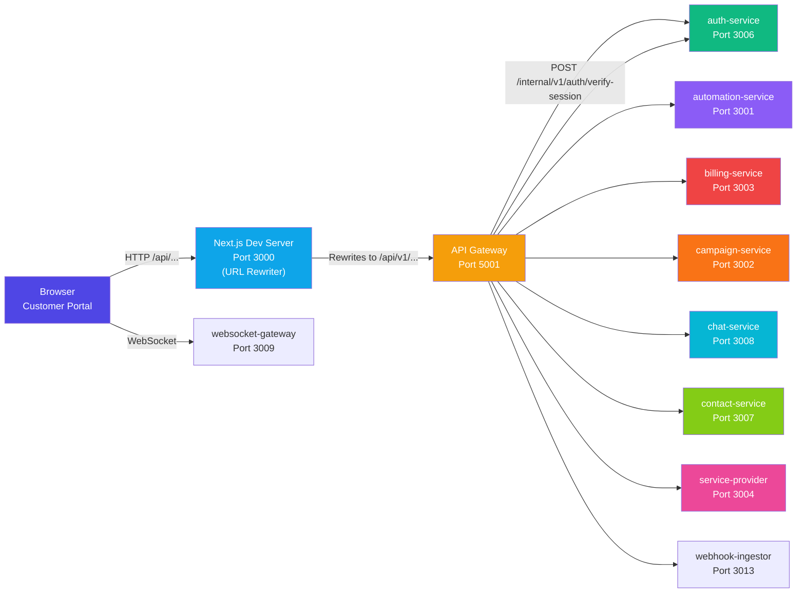
```mermaid
graph LR
    Browser["Browser\nCustomer Portal"]
    Next["Next.js Dev Server\nPort 3000\n(URL Rewriter)"]
    GW["API Gateway\nPort 5001"]
    Auth["auth-service\nPort 3006"]
    AutoSvc["automation-service\nPort 3001"]
    BillSvc["billing-service\nPort 3003"]
    CampSvc["campaign-service\nPort 3002"]
    ChatSvc["chat-service\nPort 3008"]
    ContSvc["contact-service\nPort 3007"]
    SpSvc["service-provider\nPort 3004"]
    WebhookIn["webhook-ingestor\nPort 3013"]
    WsSvc["websocket-gateway\nPort 3009"]

    Browser -->|"HTTP /api/..."| Next
    Next -->|"Rewrites to /api/v1/..."| GW
    GW -->|"POST /internal/v1/auth/verify-session"| Auth
    GW --> Auth
    GW --> AutoSvc
    GW --> BillSvc
    GW --> CampSvc
    GW --> ChatSvc
    GW --> ContSvc
    GW --> SpSvc
    GW --> WebhookIn
    Browser -->|"WebSocket"| WsSvc

    style Browser fill:#4f46e5,color:#fff
    style Next fill:#0ea5e9,color:#fff
    style GW fill:#f59e0b,color:#fff
    style Auth fill:#10b981,color:#fff
    style AutoSvc fill:#8b5cf6,color:#fff
    style BillSvc fill:#ef4444,color:#fff
    style CampSvc fill:#f97316,color:#fff
    style ChatSvc fill:#06b6d4,color:#fff
    style ContSvc fill:#84cc16,color:#fff
    style SpSvc fill:#ec4899,color:#fff
```

---

## Gateway Middleware Pipeline (Every Request)

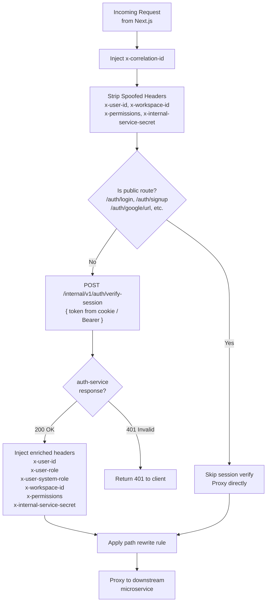
```mermaid
flowchart TD
    A["Incoming Request\nfrom Next.js"] --> B["Inject x-correlation-id"]
    B --> C["Strip Spoofed Headers\nx-user-id, x-workspace-id\nx-permissions, x-internal-service-secret"]
    C --> D{"Is public route?\n/auth/login, /auth/signup\n/auth/google/url, etc."}
    D -->|Yes| E["Skip session verify\nProxy directly"]
    D -->|No| F["POST /internal/v1/auth/verify-session\n{ token from cookie / Bearer }"]
    F --> G{"auth-service\nresponse?"}
    G -->|"401 Invalid"| H["Return 401 to client"]
    G -->|"200 OK"| I["Inject enriched headers\nx-user-id\nx-user-role\nx-user-system-role\nx-workspace-id\nx-permissions\nx-internal-service-secret"]
    I --> J["Apply path rewrite rule"]
    J --> K["Proxy to downstream\nmicroservice"]
    E --> J
```

---

## 1. Auth Flows (`auth-service` :3006)

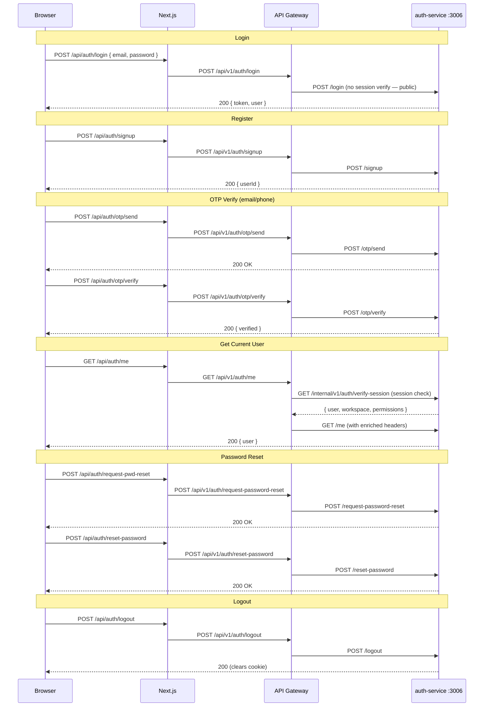
```mermaid
sequenceDiagram
    participant B as Browser
    participant N as Next.js
    participant G as API Gateway
    participant A as auth-service :3006

    Note over B,A: Login
    B->>N: POST /api/auth/login { email, password }
    N->>G: POST /api/v1/auth/login
    G->>A: POST /login  (no session verify — public)
    A-->>B: 200 { token, user }

    Note over B,A: Register
    B->>N: POST /api/auth/signup
    N->>G: POST /api/v1/auth/signup
    G->>A: POST /signup
    A-->>B: 200 { userId }

    Note over B,A: OTP Verify (email/phone)
    B->>N: POST /api/auth/otp/send
    N->>G: POST /api/v1/auth/otp/send
    G->>A: POST /otp/send
    A-->>B: 200 OK

    B->>N: POST /api/auth/otp/verify
    N->>G: POST /api/v1/auth/otp/verify
    G->>A: POST /otp/verify
    A-->>B: 200 { verified }

    Note over B,A: Get Current User
    B->>N: GET /api/auth/me
    N->>G: GET /api/v1/auth/me
    G->>A: GET /internal/v1/auth/verify-session (session check)
    A-->>G: { user, workspace, permissions }
    G->>A: GET /me (with enriched headers)
    A-->>B: 200 { user }

    Note over B,A: Password Reset
    B->>N: POST /api/auth/request-pwd-reset
    N->>G: POST /api/v1/auth/request-password-reset
    G->>A: POST /request-password-reset
    A-->>B: 200 OK

    B->>N: POST /api/auth/reset-password
    N->>G: POST /api/v1/auth/reset-password
    G->>A: POST /reset-password
    A-->>B: 200 OK

    Note over B,A: Logout
    B->>N: POST /api/auth/logout
    N->>G: POST /api/v1/auth/logout
    G->>A: POST /logout
    A-->>B: 200 (clears cookie)
```

---

## 2. Onboarding Flows (`service-provider` :3004)

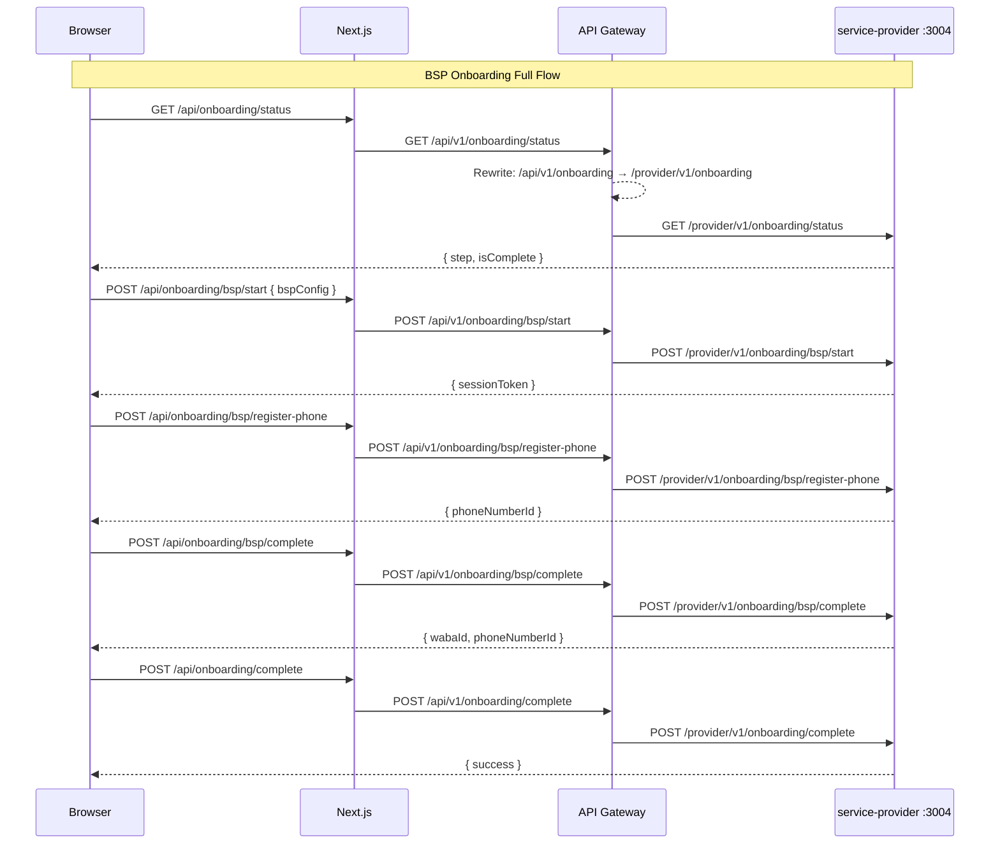
```mermaid
sequenceDiagram
    participant B as Browser
    participant N as Next.js
    participant G as API Gateway
    participant S as service-provider :3004

    Note over B,S: BSP Onboarding Full Flow

    B->>N: GET /api/onboarding/status
    N->>G: GET /api/v1/onboarding/status
    G-->>G: Rewrite: /api/v1/onboarding → /provider/v1/onboarding
    G->>S: GET /provider/v1/onboarding/status
    S-->>B: { step, isComplete }

    B->>N: POST /api/onboarding/bsp/start { bspConfig }
    N->>G: POST /api/v1/onboarding/bsp/start
    G->>S: POST /provider/v1/onboarding/bsp/start
    S-->>B: { sessionToken }

    B->>N: POST /api/onboarding/bsp/register-phone
    N->>G: POST /api/v1/onboarding/bsp/register-phone
    G->>S: POST /provider/v1/onboarding/bsp/register-phone
    S-->>B: { phoneNumberId }

    B->>N: POST /api/onboarding/bsp/complete
    N->>G: POST /api/v1/onboarding/bsp/complete
    G->>S: POST /provider/v1/onboarding/bsp/complete
    S-->>B: { wabaId, phoneNumberId }

    B->>N: POST /api/onboarding/complete
    N->>G: POST /api/v1/onboarding/complete
    G->>S: POST /provider/v1/onboarding/complete
    S-->>B: { success }
```

---

## 3. Workspace / Settings Flows

### 3a. WhatsApp Profile (`service-provider` :3004)

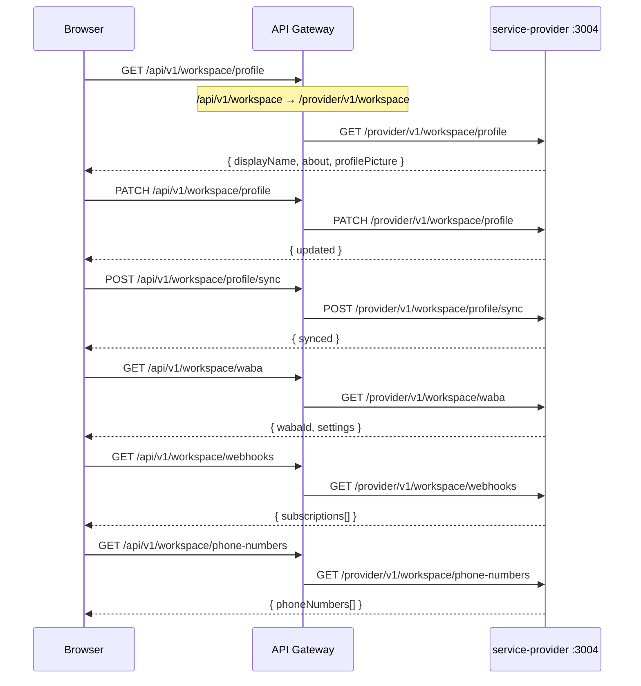
```mermaid
sequenceDiagram
    participant B as Browser
    participant G as API Gateway
    participant S as service-provider :3004

    B->>G: GET /api/v1/workspace/profile
    Note over G: /api/v1/workspace → /provider/v1/workspace
    G->>S: GET /provider/v1/workspace/profile
    S-->>B: { displayName, about, profilePicture }

    B->>G: PATCH /api/v1/workspace/profile
    G->>S: PATCH /provider/v1/workspace/profile
    S-->>B: { updated }

    B->>G: POST /api/v1/workspace/profile/sync
    G->>S: POST /provider/v1/workspace/profile/sync
    S-->>B: { synced }

    B->>G: GET /api/v1/workspace/waba
    G->>S: GET /provider/v1/workspace/waba
    S-->>B: { wabaId, settings }

    B->>G: GET /api/v1/workspace/webhooks
    G->>S: GET /provider/v1/workspace/webhooks
    S-->>B: { subscriptions[] }

    B->>G: GET /api/v1/workspace/phone-numbers
    G->>S: GET /provider/v1/workspace/phone-numbers
    S-->>B: { phoneNumbers[] }
```

### 3b. Team / Members / Roles (`auth-service` :3006)

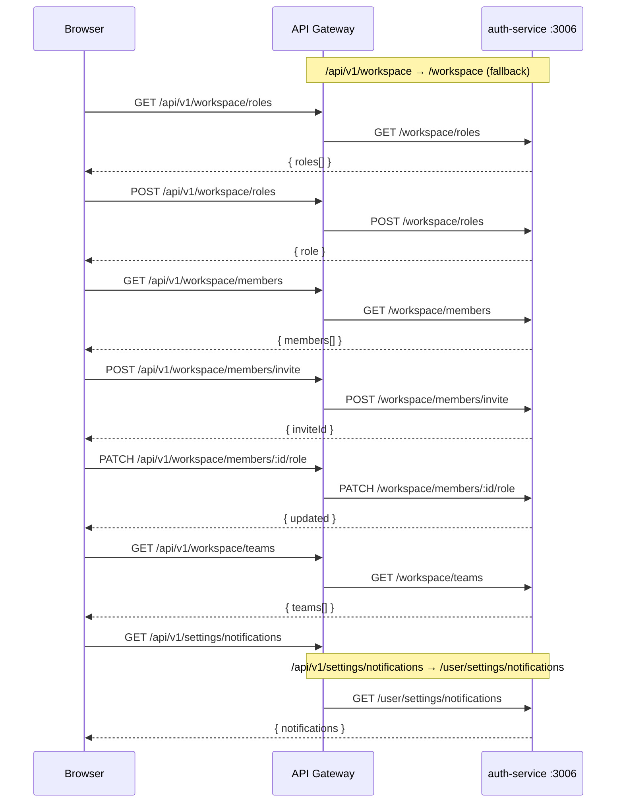
```mermaid
sequenceDiagram
    participant B as Browser
    participant G as API Gateway
    participant A as auth-service :3006

    Note over G,A: /api/v1/workspace → /workspace (fallback)

    B->>G: GET /api/v1/workspace/roles
    G->>A: GET /workspace/roles
    A-->>B: { roles[] }

    B->>G: POST /api/v1/workspace/roles
    G->>A: POST /workspace/roles
    A-->>B: { role }

    B->>G: GET /api/v1/workspace/members
    G->>A: GET /workspace/members
    A-->>B: { members[] }

    B->>G: POST /api/v1/workspace/members/invite
    G->>A: POST /workspace/members/invite
    A-->>B: { inviteId }

    B->>G: PATCH /api/v1/workspace/members/:id/role
    G->>A: PATCH /workspace/members/:id/role
    A-->>B: { updated }

    B->>G: GET /api/v1/workspace/teams
    G->>A: GET /workspace/teams
    A-->>B: { teams[] }

    B->>G: GET /api/v1/settings/notifications
    Note over G,A: /api/v1/settings/notifications → /user/settings/notifications
    G->>A: GET /user/settings/notifications
    A-->>B: { notifications }
```

### 3c. Tags / Quick Replies (`contact-service` :3007)

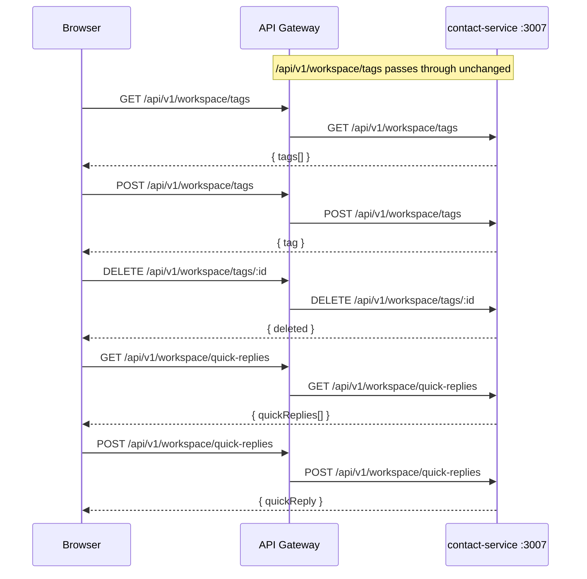
```mermaid
sequenceDiagram
    participant B as Browser
    participant G as API Gateway
    participant C as contact-service :3007

    Note over G,C: /api/v1/workspace/tags passes through unchanged

    B->>G: GET /api/v1/workspace/tags
    G->>C: GET /api/v1/workspace/tags
    C-->>B: { tags[] }

    B->>G: POST /api/v1/workspace/tags
    G->>C: POST /api/v1/workspace/tags
    C-->>B: { tag }

    B->>G: DELETE /api/v1/workspace/tags/:id
    G->>C: DELETE /api/v1/workspace/tags/:id
    C-->>B: { deleted }

    B->>G: GET /api/v1/workspace/quick-replies
    G->>C: GET /api/v1/workspace/quick-replies
    C-->>B: { quickReplies[] }

    B->>G: POST /api/v1/workspace/quick-replies
    G->>C: POST /api/v1/workspace/quick-replies
    C-->>B: { quickReply }
```

---

## 4. Billing Flows (`billing-service` :3003)

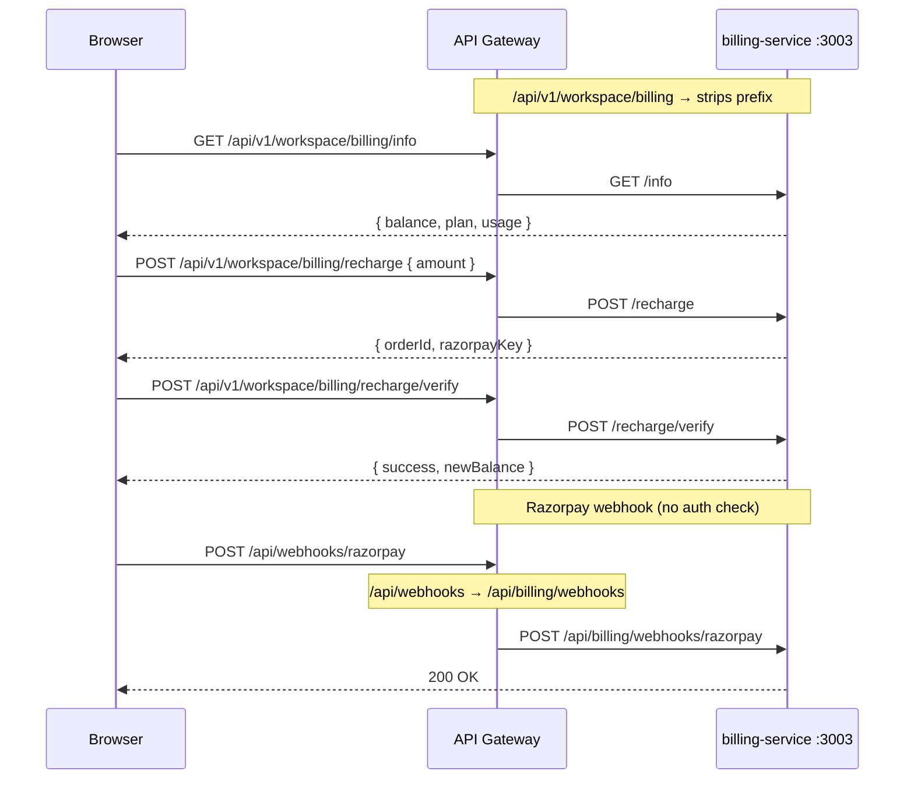
```mermaid
sequenceDiagram
    participant B as Browser
    participant G as API Gateway
    participant Bill as billing-service :3003

    Note over G,Bill: /api/v1/workspace/billing → strips prefix

    B->>G: GET /api/v1/workspace/billing/info
    G->>Bill: GET /info
    Bill-->>B: { balance, plan, usage }

    B->>G: POST /api/v1/workspace/billing/recharge { amount }
    G->>Bill: POST /recharge
    Bill-->>B: { orderId, razorpayKey }

    B->>G: POST /api/v1/workspace/billing/recharge/verify
    G->>Bill: POST /recharge/verify
    Bill-->>B: { success, newBalance }

    Note over G,Bill: Razorpay webhook (no auth check)
    B->>G: POST /api/webhooks/razorpay
    Note over G: /api/webhooks → /api/billing/webhooks
    G->>Bill: POST /api/billing/webhooks/razorpay
    Bill-->>B: 200 OK
```

---

## 5. Contacts Flows (`contact-service` :3007)

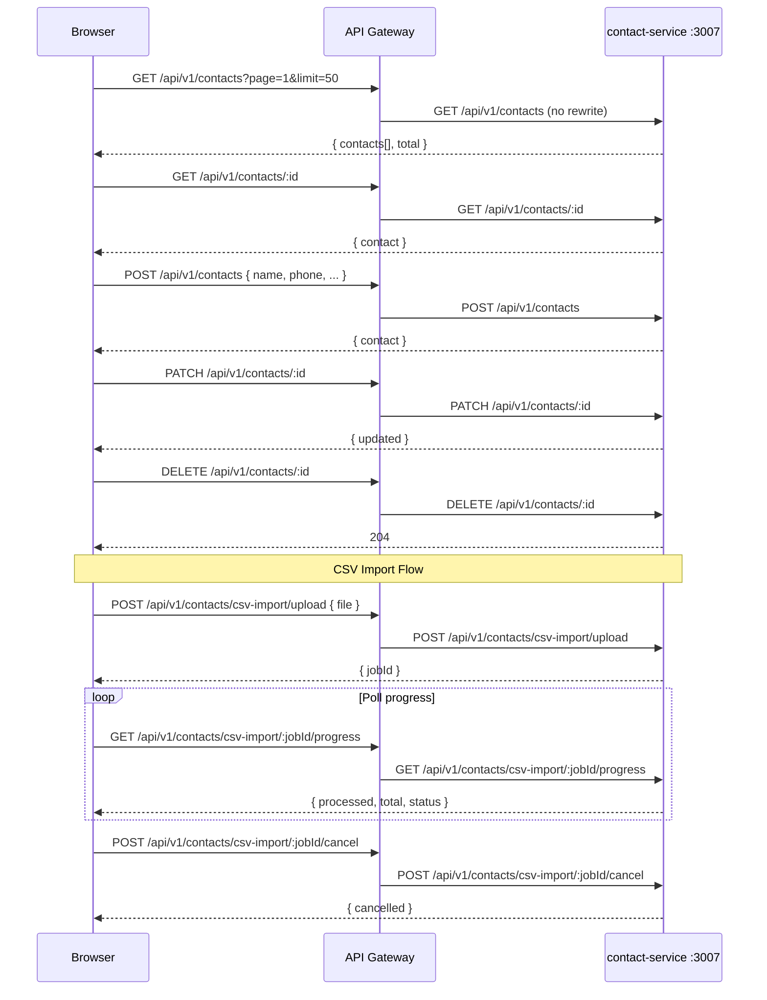
```mermaid
sequenceDiagram
    participant B as Browser
    participant G as API Gateway
    participant C as contact-service :3007

    B->>G: GET /api/v1/contacts?page=1&limit=50
    G->>C: GET /api/v1/contacts (no rewrite)
    C-->>B: { contacts[], total }

    B->>G: GET /api/v1/contacts/:id
    G->>C: GET /api/v1/contacts/:id
    C-->>B: { contact }

    B->>G: POST /api/v1/contacts { name, phone, ... }
    G->>C: POST /api/v1/contacts
    C-->>B: { contact }

    B->>G: PATCH /api/v1/contacts/:id
    G->>C: PATCH /api/v1/contacts/:id
    C-->>B: { updated }

    B->>G: DELETE /api/v1/contacts/:id
    G->>C: DELETE /api/v1/contacts/:id
    C-->>B: 204

    Note over B,C: CSV Import Flow
    B->>G: POST /api/v1/contacts/csv-import/upload { file }
    G->>C: POST /api/v1/contacts/csv-import/upload
    C-->>B: { jobId }

    loop Poll progress
        B->>G: GET /api/v1/contacts/csv-import/:jobId/progress
        G->>C: GET /api/v1/contacts/csv-import/:jobId/progress
        C-->>B: { processed, total, status }
    end

    B->>G: POST /api/v1/contacts/csv-import/:jobId/cancel
    G->>C: POST /api/v1/contacts/csv-import/:jobId/cancel
    C-->>B: { cancelled }
```

---

## 6. CRM Flows (`contact-service` :3007)

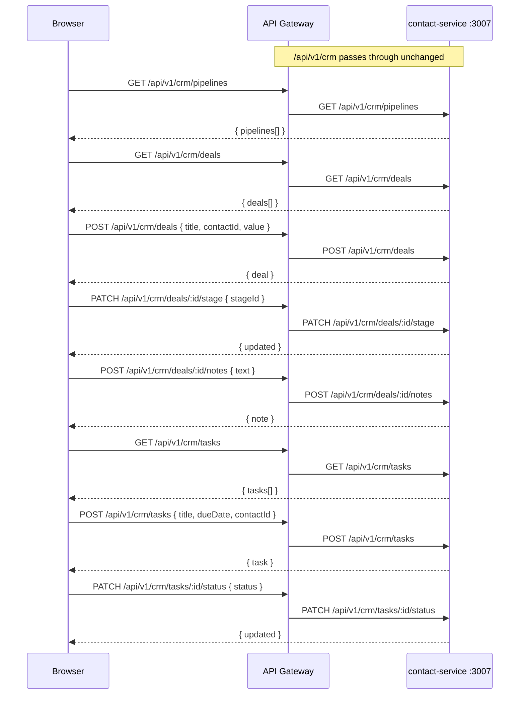
```mermaid
sequenceDiagram
    participant B as Browser
    participant G as API Gateway
    participant C as contact-service :3007

    Note over G,C: /api/v1/crm passes through unchanged

    B->>G: GET /api/v1/crm/pipelines
    G->>C: GET /api/v1/crm/pipelines
    C-->>B: { pipelines[] }

    B->>G: GET /api/v1/crm/deals
    G->>C: GET /api/v1/crm/deals
    C-->>B: { deals[] }

    B->>G: POST /api/v1/crm/deals { title, contactId, value }
    G->>C: POST /api/v1/crm/deals
    C-->>B: { deal }

    B->>G: PATCH /api/v1/crm/deals/:id/stage { stageId }
    G->>C: PATCH /api/v1/crm/deals/:id/stage
    C-->>B: { updated }

    B->>G: POST /api/v1/crm/deals/:id/notes { text }
    G->>C: POST /api/v1/crm/deals/:id/notes
    C-->>B: { note }

    B->>G: GET /api/v1/crm/tasks
    G->>C: GET /api/v1/crm/tasks
    C-->>B: { tasks[] }

    B->>G: POST /api/v1/crm/tasks { title, dueDate, contactId }
    G->>C: POST /api/v1/crm/tasks
    C-->>B: { task }

    B->>G: PATCH /api/v1/crm/tasks/:id/status { status }
    G->>C: PATCH /api/v1/crm/tasks/:id/status
    C-->>B: { updated }
```

---

## 7. Inbox / Chat Flows (`chat-service` :3008)

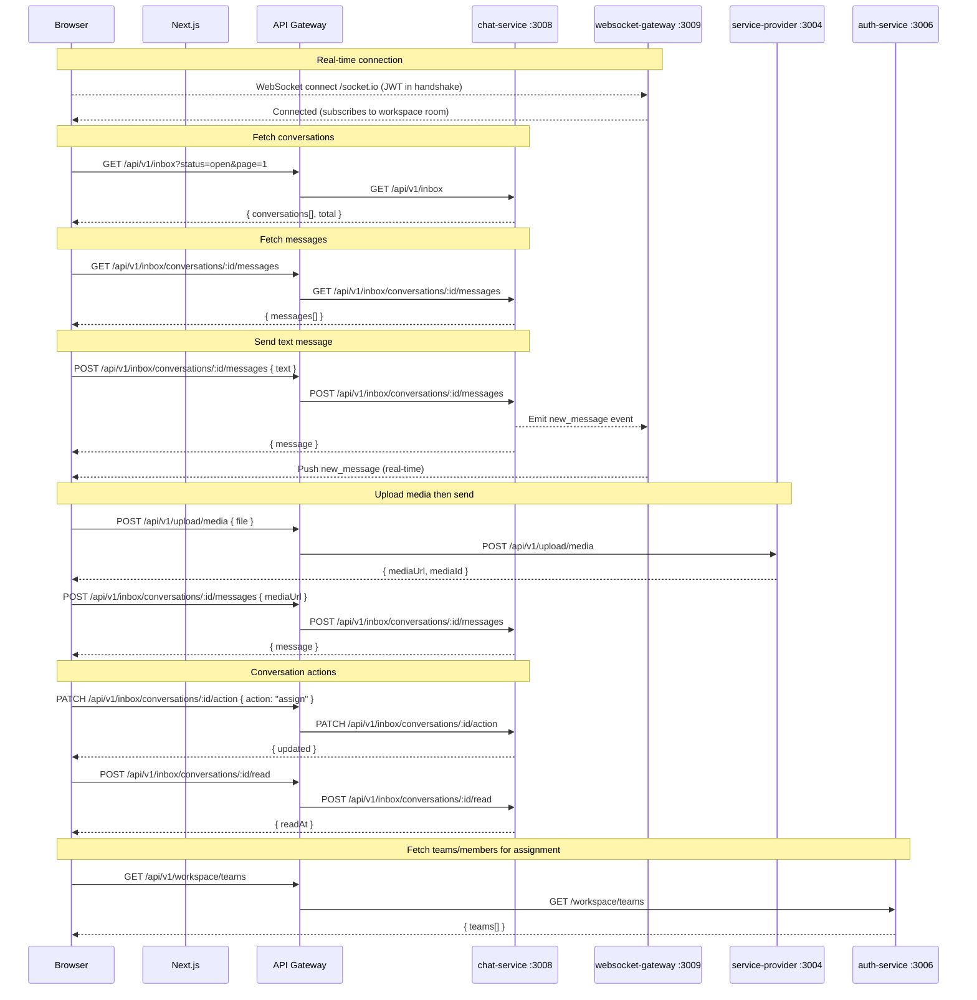
```mermaid
sequenceDiagram
    participant B as Browser
    participant N as Next.js
    participant G as API Gateway
    participant Chat as chat-service :3008
    participant WS as websocket-gateway :3009
    participant SP as service-provider :3004
    participant Auth as auth-service :3006

    Note over B,WS: Real-time connection
    B-->>WS: WebSocket connect /socket.io (JWT in handshake)
    WS-->>B: Connected (subscribes to workspace room)

    Note over B,Chat: Fetch conversations
    B->>G: GET /api/v1/inbox?status=open&page=1
    G->>Chat: GET /api/v1/inbox
    Chat-->>B: { conversations[], total }

    Note over B,Chat: Fetch messages
    B->>G: GET /api/v1/inbox/conversations/:id/messages
    G->>Chat: GET /api/v1/inbox/conversations/:id/messages
    Chat-->>B: { messages[] }

    Note over B,Chat: Send text message
    B->>G: POST /api/v1/inbox/conversations/:id/messages { text }
    G->>Chat: POST /api/v1/inbox/conversations/:id/messages
    Chat-->>WS: Emit new_message event
    Chat-->>B: { message }
    WS-->>B: Push new_message (real-time)

    Note over B,SP: Upload media then send
    B->>G: POST /api/v1/upload/media { file }
    G->>SP: POST /api/v1/upload/media
    SP-->>B: { mediaUrl, mediaId }
    B->>G: POST /api/v1/inbox/conversations/:id/messages { mediaUrl }
    G->>Chat: POST /api/v1/inbox/conversations/:id/messages
    Chat-->>B: { message }

    Note over B,Chat: Conversation actions
    B->>G: PATCH /api/v1/inbox/conversations/:id/action { action: "assign" }
    G->>Chat: PATCH /api/v1/inbox/conversations/:id/action
    Chat-->>B: { updated }

    B->>G: POST /api/v1/inbox/conversations/:id/read
    G->>Chat: POST /api/v1/inbox/conversations/:id/read
    Chat-->>B: { readAt }

    Note over B,Auth: Fetch teams/members for assignment
    B->>G: GET /api/v1/workspace/teams
    G->>Auth: GET /workspace/teams
    Auth-->>B: { teams[] }
```

---

## 8. Templates Flows (`service-provider` :3004)

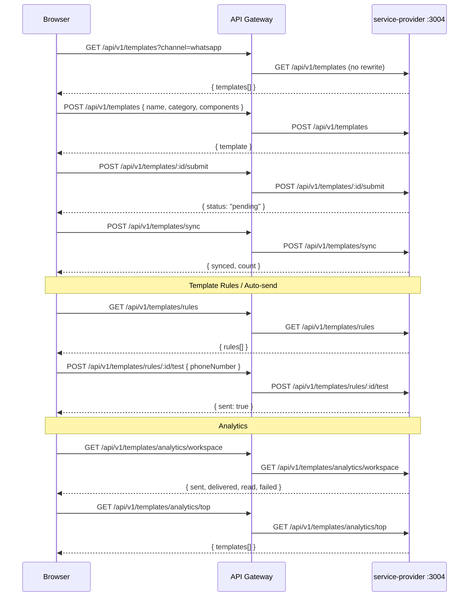
```mermaid
sequenceDiagram
    participant B as Browser
    participant G as API Gateway
    participant S as service-provider :3004

    B->>G: GET /api/v1/templates?channel=whatsapp
    G->>S: GET /api/v1/templates (no rewrite)
    S-->>B: { templates[] }

    B->>G: POST /api/v1/templates { name, category, components }
    G->>S: POST /api/v1/templates
    S-->>B: { template }

    B->>G: POST /api/v1/templates/:id/submit
    G->>S: POST /api/v1/templates/:id/submit
    S-->>B: { status: "pending" }

    B->>G: POST /api/v1/templates/sync
    G->>S: POST /api/v1/templates/sync
    S-->>B: { synced, count }

    Note over B,S: Template Rules / Auto-send
    B->>G: GET /api/v1/templates/rules
    G->>S: GET /api/v1/templates/rules
    S-->>B: { rules[] }

    B->>G: POST /api/v1/templates/rules/:id/test { phoneNumber }
    G->>S: POST /api/v1/templates/rules/:id/test
    S-->>B: { sent: true }

    Note over B,S: Analytics
    B->>G: GET /api/v1/templates/analytics/workspace
    G->>S: GET /api/v1/templates/analytics/workspace
    S-->>B: { sent, delivered, read, failed }

    B->>G: GET /api/v1/templates/analytics/top
    G->>S: GET /api/v1/templates/analytics/top
    S-->>B: { templates[] }
```

---

## 9. Campaigns Flows (`campaign-service` :3002)

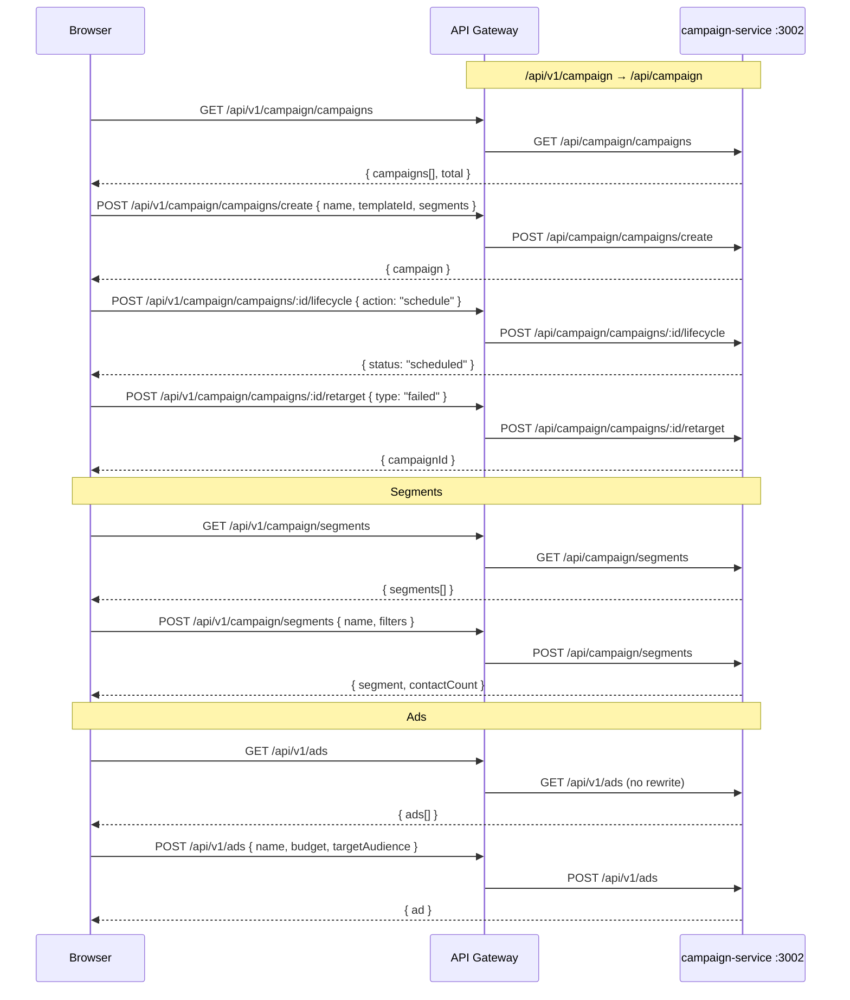
```mermaid
sequenceDiagram
    participant B as Browser
    participant G as API Gateway
    participant Cam as campaign-service :3002

    Note over G,Cam: /api/v1/campaign → /api/campaign

    B->>G: GET /api/v1/campaign/campaigns
    G->>Cam: GET /api/campaign/campaigns
    Cam-->>B: { campaigns[], total }

    B->>G: POST /api/v1/campaign/campaigns/create { name, templateId, segments }
    G->>Cam: POST /api/campaign/campaigns/create
    Cam-->>B: { campaign }

    B->>G: POST /api/v1/campaign/campaigns/:id/lifecycle { action: "schedule" }
    G->>Cam: POST /api/campaign/campaigns/:id/lifecycle
    Cam-->>B: { status: "scheduled" }

    B->>G: POST /api/v1/campaign/campaigns/:id/retarget { type: "failed" }
    G->>Cam: POST /api/campaign/campaigns/:id/retarget
    Cam-->>B: { campaignId }

    Note over B,Cam: Segments
    B->>G: GET /api/v1/campaign/segments
    G->>Cam: GET /api/campaign/segments
    Cam-->>B: { segments[] }

    B->>G: POST /api/v1/campaign/segments { name, filters }
    G->>Cam: POST /api/campaign/segments
    Cam-->>B: { segment, contactCount }

    Note over B,Cam: Ads
    B->>G: GET /api/v1/ads
    G->>Cam: GET /api/v1/ads (no rewrite)
    Cam-->>B: { ads[] }

    B->>G: POST /api/v1/ads { name, budget, targetAudience }
    G->>Cam: POST /api/v1/ads
    Cam-->>B: { ad }
```

---

## 10. Automation Flows (`automation-service` :3001)

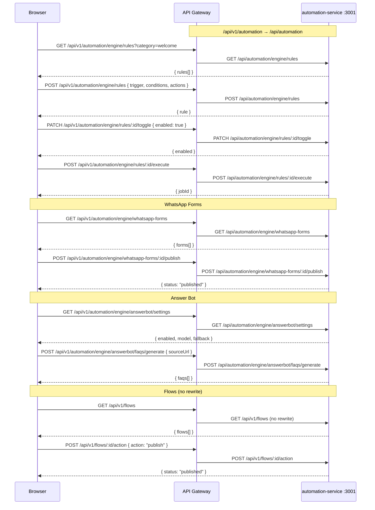
```mermaid
sequenceDiagram
    participant B as Browser
    participant G as API Gateway
    participant Auto as automation-service :3001

    Note over G,Auto: /api/v1/automation → /api/automation

    B->>G: GET /api/v1/automation/engine/rules?category=welcome
    G->>Auto: GET /api/automation/engine/rules
    Auto-->>B: { rules[] }

    B->>G: POST /api/v1/automation/engine/rules { trigger, conditions, actions }
    G->>Auto: POST /api/automation/engine/rules
    Auto-->>B: { rule }

    B->>G: PATCH /api/v1/automation/engine/rules/:id/toggle { enabled: true }
    G->>Auto: PATCH /api/automation/engine/rules/:id/toggle
    Auto-->>B: { enabled }

    B->>G: POST /api/v1/automation/engine/rules/:id/execute
    G->>Auto: POST /api/automation/engine/rules/:id/execute
    Auto-->>B: { jobId }

    Note over B,Auto: WhatsApp Forms
    B->>G: GET /api/v1/automation/engine/whatsapp-forms
    G->>Auto: GET /api/automation/engine/whatsapp-forms
    Auto-->>B: { forms[] }

    B->>G: POST /api/v1/automation/engine/whatsapp-forms/:id/publish
    G->>Auto: POST /api/automation/engine/whatsapp-forms/:id/publish
    Auto-->>B: { status: "published" }

    Note over B,Auto: Answer Bot
    B->>G: GET /api/v1/automation/engine/answerbot/settings
    G->>Auto: GET /api/automation/engine/answerbot/settings
    Auto-->>B: { enabled, model, fallback }

    B->>G: POST /api/v1/automation/engine/answerbot/faqs/generate { sourceUrl }
    G->>Auto: POST /api/automation/engine/answerbot/faqs/generate
    Auto-->>B: { faqs[] }

    Note over B,Auto: Flows (no rewrite)
    B->>G: GET /api/v1/flows
    G->>Auto: GET /api/v1/flows (no rewrite)
    Auto-->>B: { flows[] }

    B->>G: POST /api/v1/flows/:id/action { action: "publish" }
    G->>Auto: POST /api/v1/flows/:id/action
    Auto-->>B: { status: "published" }
```

---

## 11. Commerce Flows (`billing-service` :3003)

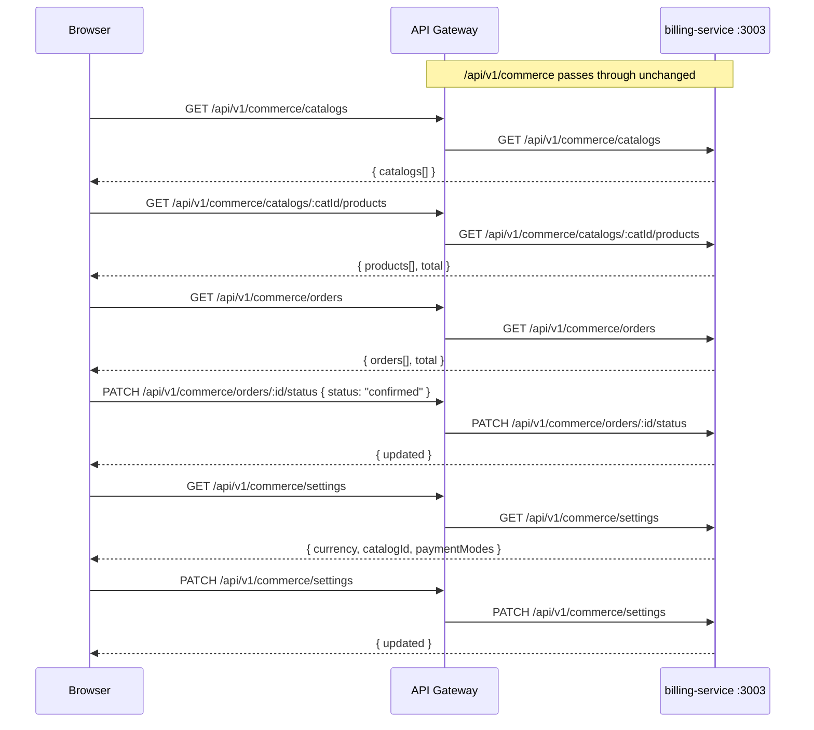
```mermaid
sequenceDiagram
    participant B as Browser
    participant G as API Gateway
    participant Bill as billing-service :3003

    Note over G,Bill: /api/v1/commerce passes through unchanged

    B->>G: GET /api/v1/commerce/catalogs
    G->>Bill: GET /api/v1/commerce/catalogs
    Bill-->>B: { catalogs[] }

    B->>G: GET /api/v1/commerce/catalogs/:catId/products
    G->>Bill: GET /api/v1/commerce/catalogs/:catId/products
    Bill-->>B: { products[], total }

    B->>G: GET /api/v1/commerce/orders
    G->>Bill: GET /api/v1/commerce/orders
    Bill-->>B: { orders[], total }

    B->>G: PATCH /api/v1/commerce/orders/:id/status { status: "confirmed" }
    G->>Bill: PATCH /api/v1/commerce/orders/:id/status
    Bill-->>B: { updated }

    B->>G: GET /api/v1/commerce/settings
    G->>Bill: GET /api/v1/commerce/settings
    Bill-->>B: { currency, catalogId, paymentModes }

    B->>G: PATCH /api/v1/commerce/settings
    G->>Bill: PATCH /api/v1/commerce/settings
    Bill-->>B: { updated }
```

---

## 12. Support / Tickets Flows (`chat-service` :3008)

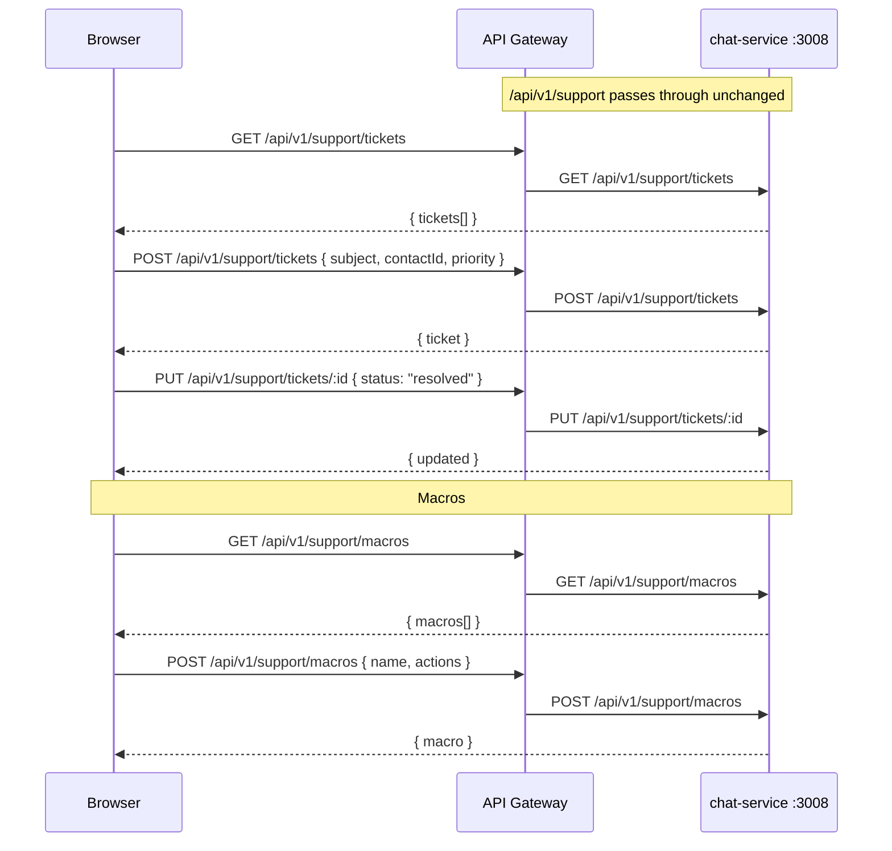
```mermaid
sequenceDiagram
    participant B as Browser
    participant G as API Gateway
    participant Chat as chat-service :3008

    Note over G,Chat: /api/v1/support passes through unchanged

    B->>G: GET /api/v1/support/tickets
    G->>Chat: GET /api/v1/support/tickets
    Chat-->>B: { tickets[] }

    B->>G: POST /api/v1/support/tickets { subject, contactId, priority }
    G->>Chat: POST /api/v1/support/tickets
    Chat-->>B: { ticket }

    B->>G: PUT /api/v1/support/tickets/:id { status: "resolved" }
    G->>Chat: PUT /api/v1/support/tickets/:id
    Chat-->>B: { updated }

    Note over B,Chat: Macros
    B->>G: GET /api/v1/support/macros
    G->>Chat: GET /api/v1/support/macros
    Chat-->>B: { macros[] }

    B->>G: POST /api/v1/support/macros { name, actions }
    G->>Chat: POST /api/v1/support/macros
    Chat-->>B: { macro }
```

---

## 13. Integrations & Widget Flows (`automation-service` :3001)

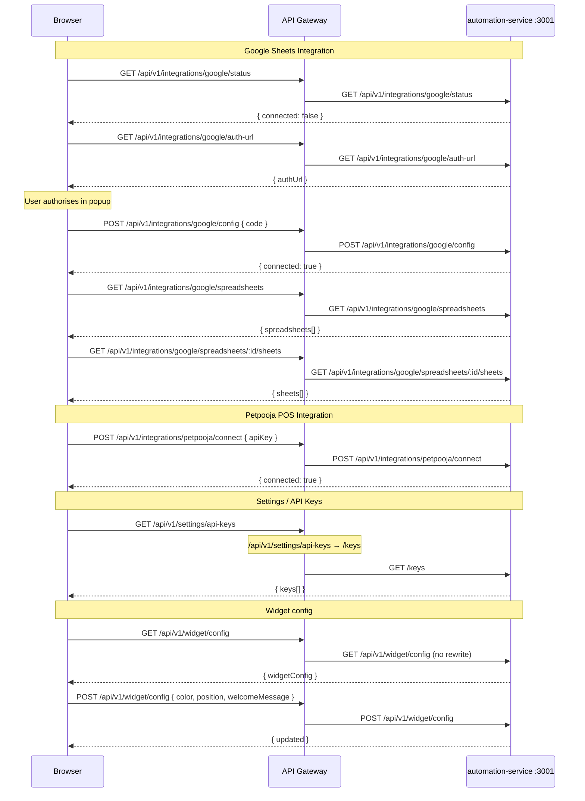
```mermaid
sequenceDiagram
    participant B as Browser
    participant G as API Gateway
    participant Auto as automation-service :3001

    Note over B,Auto: Google Sheets Integration
    B->>G: GET /api/v1/integrations/google/status
    G->>Auto: GET /api/v1/integrations/google/status
    Auto-->>B: { connected: false }

    B->>G: GET /api/v1/integrations/google/auth-url
    G->>Auto: GET /api/v1/integrations/google/auth-url
    Auto-->>B: { authUrl }

    Note over B: User authorises in popup
    B->>G: POST /api/v1/integrations/google/config { code }
    G->>Auto: POST /api/v1/integrations/google/config
    Auto-->>B: { connected: true }

    B->>G: GET /api/v1/integrations/google/spreadsheets
    G->>Auto: GET /api/v1/integrations/google/spreadsheets
    Auto-->>B: { spreadsheets[] }

    B->>G: GET /api/v1/integrations/google/spreadsheets/:id/sheets
    G->>Auto: GET /api/v1/integrations/google/spreadsheets/:id/sheets
    Auto-->>B: { sheets[] }

    Note over B,Auto: Petpooja POS Integration
    B->>G: POST /api/v1/integrations/petpooja/connect { apiKey }
    G->>Auto: POST /api/v1/integrations/petpooja/connect
    Auto-->>B: { connected: true }

    Note over B,Auto: Settings / API Keys
    B->>G: GET /api/v1/settings/api-keys
    Note over G: /api/v1/settings/api-keys → /keys
    G->>Auto: GET /keys
    Auto-->>B: { keys[] }

    Note over B,Auto: Widget config
    B->>G: GET /api/v1/widget/config
    G->>Auto: GET /api/v1/widget/config (no rewrite)
    Auto-->>B: { widgetConfig }

    B->>G: POST /api/v1/widget/config { color, position, welcomeMessage }
    G->>Auto: POST /api/v1/widget/config
    Auto-->>B: { updated }
```

---

## 14. Analytics Flows (`chat-service` :3008)

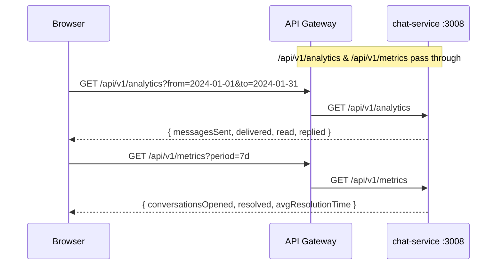
```mermaid
sequenceDiagram
    participant B as Browser
    participant G as API Gateway
    participant Chat as chat-service :3008

    Note over G,Chat: /api/v1/analytics & /api/v1/metrics pass through

    B->>G: GET /api/v1/analytics?from=2024-01-01&to=2024-01-31
    G->>Chat: GET /api/v1/analytics
    Chat-->>B: { messagesSent, delivered, read, replied }

    B->>G: GET /api/v1/metrics?period=7d
    G->>Chat: GET /api/v1/metrics
    Chat-->>B: { conversationsOpened, resolved, avgResolutionTime }
```

---

## 15. Business Verification Flows (`auth-service` :3006)

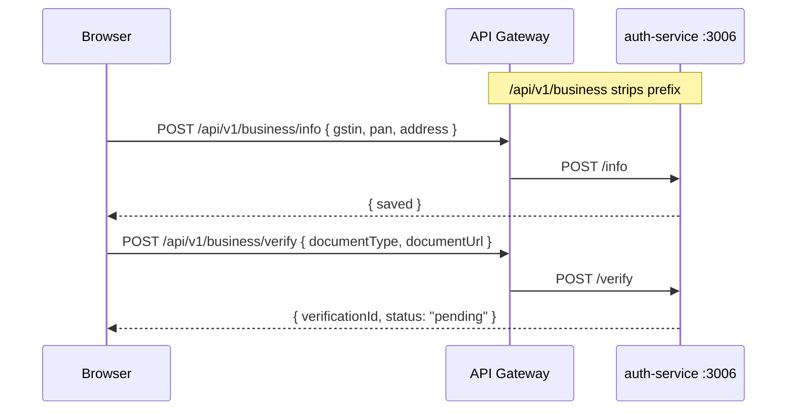
```mermaid
sequenceDiagram
    participant B as Browser
    participant G as API Gateway
    participant A as auth-service :3006

    Note over G,A: /api/v1/business strips prefix

    B->>G: POST /api/v1/business/info { gstin, pan, address }
    G->>A: POST /info
    A-->>B: { saved }

    B->>G: POST /api/v1/business/verify { documentType, documentUrl }
    G->>A: POST /verify
    A-->>B: { verificationId, status: "pending" }
```

---

## 16. WebSocket Real-Time Flow

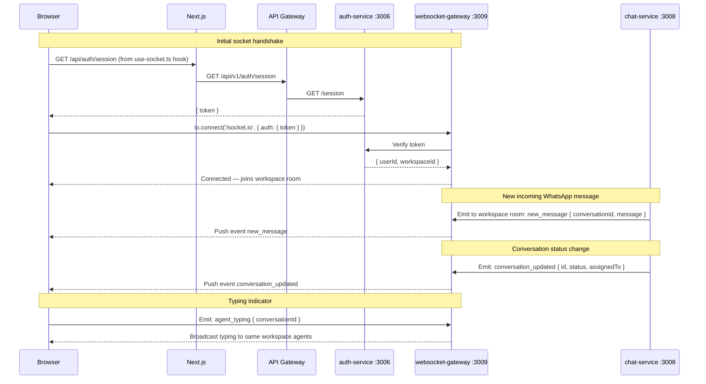
```mermaid
sequenceDiagram
    participant B as Browser
    participant N as Next.js
    participant G as API Gateway
    participant A as auth-service :3006
    participant WS as websocket-gateway :3009
    participant Chat as chat-service :3008

    Note over B,WS: Initial socket handshake
    B->>N: GET /api/auth/session  (from use-socket.ts hook)
    N->>G: GET /api/v1/auth/session
    G->>A: GET /session
    A-->>B: { token }

    B->>WS: io.connect('/socket.io', { auth: { token } })
    WS->>A: Verify token
    A-->>WS: { userId, workspaceId }
    WS-->>B: Connected — joins workspace room

    Note over Chat,WS: New incoming WhatsApp message
    Chat->>WS: Emit to workspace room: new_message { conversationId, message }
    WS-->>B: Push event new_message

    Note over Chat,WS: Conversation status change
    Chat->>WS: Emit: conversation_updated { id, status, assignedTo }
    WS-->>B: Push event conversation_updated

    Note over B,WS: Typing indicator
    B->>WS: Emit: agent_typing { conversationId }
    WS-->>B: Broadcast typing to same workspace agents
```

---

## Full URL Transformation Reference

```mermaid
graph LR
    subgraph "Frontend (axios base: /api)"
        F1["/auth/login"]
        F2["/workspace/profile"]
        F3["/workspace/tags"]
        F4["/onboarding/bsp/start"]
        F5["/campaign/campaigns"]
        F6["/automation/engine/rules"]
        F7["/contacts"]
        F8["/inbox"]
        F9["/templates"]
        F10["/billing/info"]
        F11["/flows"]
        F12["/support/tickets"]
        F13["/commerce/orders"]
        F14["/crm/deals"]
    end

    subgraph "After Next.js Rewrite (/api → /api/v1)"
        N1["/api/v1/auth/login"]
        N2["/api/v1/workspace/profile"]
        N3["/api/v1/workspace/tags"]
        N4["/api/v1/onboarding/bsp/start"]
        N5["/api/v1/campaign/campaigns"]
        N6["/api/v1/automation/engine/rules"]
        N7["/api/v1/contacts"]
        N8["/api/v1/inbox"]
        N9["/api/v1/templates"]
        N10["/api/v1/billing/info"]
        N11["/api/v1/flows"]
        N12["/api/v1/support/tickets"]
        N13["/api/v1/commerce/orders"]
        N14["/api/v1/crm/deals"]
    end

    subgraph "Downstream (after Gateway rewrite)"
        D1["auth :3006 → /login"]
        D2["sp :3004 → /provider/v1/workspace/profile"]
        D3["contact :3007 → /api/v1/workspace/tags"]
        D4["sp :3004 → /provider/v1/onboarding/bsp/start"]
        D5["campaign :3002 → /api/campaign/campaigns"]
        D6["auto :3001 → /api/automation/engine/rules"]
        D7["contact :3007 → /api/v1/contacts"]
        D8["chat :3008 → /api/v1/inbox"]
        D9["sp :3004 → /api/v1/templates"]
        D10["billing :3003 → /api/billing/wallets/info"]
        D11["auto :3001 → /api/v1/flows"]
        D12["chat :3008 → /api/v1/support/tickets"]
        D13["billing :3003 → /api/v1/commerce/orders"]
        D14["contact :3007 → /api/v1/crm/deals"]
    end

    F1 --> N1 --> D1
    F2 --> N2 --> D2
    F3 --> N3 --> D3
    F4 --> N4 --> D4
    F5 --> N5 --> D5
    F6 --> N6 --> D6
    F7 --> N7 --> D7
    F8 --> N8 --> D8
    F9 --> N9 --> D9
    F10 --> N10 --> D10
    F11 --> N11 --> D11
    F12 --> N12 --> D12
    F13 --> N13 --> D13
    F14 --> N14 --> D14
```
