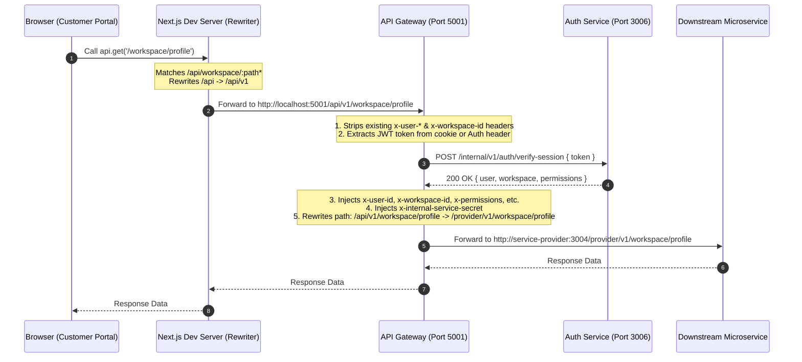

# Customer Portal API Mapping and Routing Flow

This document lists all frontend API calls defined in the **Customer Portal** (`apps/customer-portal`) and maps how they route through the **API Gateway** (`services/api-gateway`) to the downstream microservices.

---

## 1. Request Life-Cycle Overview

The following diagram illustrates how a frontend request from the Customer Portal reaches a downstream microservice:

---

## 2. Next.js Routing & Rewrites

The Next.js client utilizes `axios` with a base URL of `/api`. In `next.config.ts`, these routes are rewritten to point to the backend API Gateway (typically `http://localhost:5001` or the `BACKEND_API_URL` environment variable).

| Frontend Request Source Path | Gateway Destination URL Path | Description |
|:---|:---|:---|
| `/api/automation/:path*` | `/api/v1/automation/:path*` | Automation rule management |
| `/api/campaign/:path*` | `/api/v1/campaign/:path*` | Core campaign operations |
| `/api/whatsapp-forms/:path*` | `/api/v1/automation/engine/whatsapp-forms/:path*` | Interactive forms |
| `/api/whatsapp-forms` | `/api/v1/automation/engine/whatsapp-forms` | Interactive forms root |
| `/api/campaigns/:path*` | `/api/v1/campaign/campaigns/:path*` | Marketing campaigns |
| `/api/campaigns` | `/api/v1/campaign/campaigns` | Marketing campaigns root |
| `/api/segments/:path*` | `/api/v1/campaign/segments/:path*` | Contact segmentation |
| `/api/segments` | `/api/v1/campaign/segments` | Contact segmentation root |
| `/api/workspace/:path*` | `/api/v1/workspace/:path*` | Workspace settings and setups |
| `/api/billing/:path*` | `/api/v1/billing/:path*` | Invoicing, plan limits, & payments |
| `/api/admin/:path*` | `/api/v1/super-admin/:path*` | Super administrator operations |
| `/api/:path*` *(Fallback)* | `/api/v1/:path*` | Default fallback mapping |

---

## 3. API Gateway Middleware & Routing

When requests hit the API Gateway, they go through several operations before proxying:

### Security & Header Enrichment
1. **Correlation ID**: Injects or propagates `x-correlation-id`.
2. **Spoof Prevention**: Forcefully deletes incoming client headers like `x-user-id`, `x-workspace-id`, `x-permissions`, and `x-internal-service-secret`.
3. **Session Verification**: 
   - Validates cookies or `Bearer` tokens against `auth-service` (`/internal/v1/auth/verify-session`).
   - If verified, injects the following headers into the upstream request:
     - `x-user-id`: The authenticated user's database ID.
     - `x-user-role`: The user's role in the active workspace.
     - `x-user-system-role`: The user's global system role.
     - `x-workspace-id`: The active workspace database ID.
     - `x-permissions`: Encoded URI string of permission nodes.
     - `x-internal-service-secret`: Internal secret to authorize microservice-to-microservice traffic.

### Gateway Routing Table

| Gateway Route Path | Destination Microservice | Port | Rewrite Action |
|:---|:---|:---|:---|
| `/api/v1/auth` | `auth-service` | `3006` | Strips `/api/v1/auth` |
| `/api/v1/super-admin` | `auth-service` | `3006` | `/api/v1/super-admin` → `/super-admin` |
| `/api/v1/workspace/billing` | `billing-service` | `3003` | Strips `/api/v1/workspace/billing` |
| `/api/v1/workspace/pricing` | `billing-service` | `3003` | `/api/v1/workspace/pricing` → `/pricing` |
| `/api/v1/workspace/tags` | `contact-service` | `3007` | No rewriting (passes full path) |
| `/api/v1/workspace/quick-replies`| `contact-service` | `3007` | No rewriting (passes full path) |
| `/api/v1/workspace/waba` | `service-provider`| `3004` | `/api/v1/workspace` → `/provider/v1/workspace` |
| `/api/v1/workspace/profile` | `service-provider`| `3004` | `/api/v1/workspace` → `/provider/v1/workspace` |
| `/api/v1/workspace/webhooks` | `service-provider`| `3004` | `/api/v1/workspace` → `/provider/v1/workspace` |
| `/api/v1/workspace/whatsapp/health`| `service-provider`| `3004` | `/api/v1/workspace` → `/provider/v1/workspace` |
| `/api/v1/workspace/phone-numbers`| `service-provider`| `3004` | `/api/v1/workspace` → `/provider/v1/workspace` |
| `/api/v1/workspace/connection-status`| `service-provider`| `3004` | `/api/v1/workspace` → `/provider/v1/workspace` |
| `/api/v1/workspace` *(Fallback)* | `auth-service` | `3006` | `/api/v1/workspace` → `/workspace` |
| `/api/v1/settings/api-keys` | `automation-service`| `3001` | `/api/v1/settings/api-keys` → `/keys` |
| `/api/v1/settings/integrations`| `automation-service`| `3001` | `/api/v1/settings/integrations` → `/api/v1/integrations` |
| `/api/v1/settings/team` | `auth-service` | `3006` | `/api/v1/settings/team` → `/workspace/members` |
| `/api/v1/settings/notifications`| `auth-service` | `3006` | `/api/v1/settings/notifications` → `/user/settings/notifications` |
| `/api/v1/settings/workspace` | `auth-service` | `3006` | `/api/v1/settings/workspace` → `/workspace/settings` |
| `/api/v1/settings/billing` | `billing-service` | `3003` | `/api/v1/settings/billing` → `/info` (GET) or `/settings` (others) |
| `/api/v1/settings` *(Fallback)* | `auth-service` | `3006` | `/api/v1/settings` → `/workspace/settings` |
| `/api/v1/business` | `auth-service` | `3006` | Strips `/api/v1/business` |
| `/api/v1/tags` | `contact-service` | `3007` | No rewriting |
| `/api/v1/messaging/quick-replies`| `contact-service` | `3007` | No rewriting |
| `/api/v1/inbox/settings` | `auth-service` | `3006` | `/api/v1/inbox/settings` → `/workspace/inbox/settings` |
| `/api/v1/contacts/:id/send-template`| `chat-service` | `3008` | `/api/v1/contacts/` → `/api/v1/inbox/contacts/` |
| `/api/v1/contacts` | `contact-service` | `3007` | No rewriting |
| `/api/v1/crm` | `contact-service` | `3007` | No rewriting |
| `/api/v1/bulk` | `contact-service` | `3007` | No rewriting |
| `/api/v1/inbox` | `chat-service` | `3008` | No rewriting |
| `/api/v1/conversations` | `chat-service` | `3008` | No rewriting |
| `/api/v1/analytics` | `chat-service` | `3008` | No rewriting |
| `/api/v1/metrics` | `chat-service` | `3008` | No rewriting |
| `/api/v1/support` | `chat-service` | `3008` | No rewriting |
| `/api/v1/billing` | `billing-service` | `3003` | `/api/v1/billing` → `/api/billing/wallets` |
| `/api/v1/commerce` | `billing-service` | `3003` | No rewriting |
| `/api/v1/campaign` | `campaign-service` | `3002` | `/api/v1/campaign` → `/api/campaign` |
| `/api/v1/ads` | `campaign-service` | `3002` | No rewriting |
| `/api/v1/automation` | `automation-service`| `3001` | `/api/v1/automation` → `/api/automation` |
| `/api/v1/flows` | `automation-service`| `3001` | No rewriting |
| `/api/v1/widget` | `automation-service`| `3001` | No rewriting |
| `/api/v1/developer` | `automation-service`| `3001` | No rewriting |
| `/api/v1/integrations` | `automation-service`| `3001` | No rewriting |
| `/api/v1/onboarding/provider` | `service-provider`| `3004` | `/api/v1/onboarding/provider` → `/provider/v1/onboarding` |
| `/api/v1/onboarding` *(Fallback)* | `service-provider`| `3004` | `/api/v1/onboarding` → `/provider/v1/onboarding` |
| `/api/v1/templates` | `service-provider`| `3004` | No rewriting |
| `/api/v1/upload` | `service-provider`| `3004` | No rewriting |
| `/api/webhooks/razorpay` | `billing-service` | `3003` | `/api/webhooks` → `/api/billing/webhooks` |
| `/api/webhooks` *(Fallback)* | `webhook-ingestor`| `3013` | `/api/webhooks` → `/webhooks` |
| `/socket.io` *(WebSockets)* | `websocket-gateway`| `3009` | Connects socket connections directly |

---

## 4. Complete API Call Directory by File

> [!NOTE]
> All paths in the tables below are relative to `/api` on the frontend client (since Axios prefixes all calls).
> Downstream paths indicate what the microservice receives after Next.js rewriting and Gateway path transformation.

### 4.1. [ads.ts](file:///Users/vivekkumar/devlopment/wApi/apps/customer-portal/src/lib/api/ads.ts)

| Function Name | HTTP Method | Frontend URL Path | Gateway Routing & Rewrite | Downstream Microservice Path | Destination Service |
|:---|:---|:---|:---|:---|:---|
| `getAds()` | GET | `/ads` | `/api/v1/ads` (no rewrite) | `/api/v1/ads` | `campaign-service` (3002) |
| `createAd(data)` | POST | `/ads` | `/api/v1/ads` (no rewrite) | `/api/v1/ads` | `campaign-service` (3002) |
| `updateAd(id, data)` | PUT | `/ads/:id` | `/api/v1/ads/:id` (no rewrite) | `/api/v1/ads/:id` | `campaign-service` (3002) |
| `deleteAd(id)` | DELETE | `/ads/:id` | `/api/v1/ads/:id` (no rewrite) | `/api/v1/ads/:id` | `campaign-service` (3002) |

---

### 4.2. [auth.ts](file:///Users/vivekkumar/devlopment/wApi/apps/customer-portal/src/lib/api/auth.ts)

| Function Name | HTTP Method | Frontend URL Path | Gateway Routing & Rewrite | Downstream Microservice Path | Destination Service |
|:---|:---|:---|:---|:---|:---|
| `loginUser(data)` | POST | `/auth/login` | Strips `/api/v1/auth` | `/login` | `auth-service` (3006) |
| `registerUser(userData)` | POST | `/auth/signup` | Strips `/api/v1/auth` | `/signup` | `auth-service` (3006) |
| `verifySignupOtp(email, otp)`| POST | `/auth/verify-signup-otp` | Strips `/api/v1/auth` | `/verify-signup-otp` | `auth-service` (3006) |
| `getGoogleAuthUrl(type)` | GET | `/auth/google/url?type=...`| Strips `/api/v1/auth` | `/google/url?type=...` | `auth-service` (3006) |
| `facebookLogin(token)` | POST | `/auth/facebook` | Strips `/api/v1/auth` | `/facebook` | `auth-service` (3006) |
| `logoutUser()` | POST | `/auth/logout` | Strips `/api/v1/auth` | `/logout` | `auth-service` (3006) |
| `getCurrentUser()` | GET | `/auth/me` | Strips `/api/v1/auth` | `/me` | `auth-service` (3006) |
| `sendEmailVerificationOTP(e)`| POST | `/auth/otp/send` *(email)* | Strips `/api/v1/auth` | `/otp/send` | `auth-service` (3006) |
| `verifyEmailOTP(otp, e)` | POST | `/auth/otp/verify` *(email)*| Strips `/api/v1/auth` | `/otp/verify` | `auth-service` (3006) |
| `sendMobileVerificationOTP(p)`| POST | `/auth/otp/send` *(phone)* | Strips `/api/v1/auth` | `/otp/send` | `auth-service` (3006) |
| `verifyMobileVerificationOTP`| POST | `/auth/otp/verify` *(phone)*| Strips `/api/v1/auth` | `/otp/verify` | `auth-service` (3006) |
| `requestPasswordReset(data)`| POST | `/auth/request-password-reset` | Strips `/api/v1/auth` | `/request-password-reset` | `auth-service` (3006) |
| `resetPassword(data)` | POST | `/auth/reset-password` | Strips `/api/v1/auth` | `/reset-password` | `auth-service` (3006) |
| `updateCurrentUserProfile(d)`| PATCH | `/auth/me` | Strips `/api/v1/auth` | `/me` | `auth-service` (3006) |
| `sendOtp(data)` | POST | `/auth/otp/send` *(custom)*| Strips `/api/v1/auth` | `/otp/send` | `auth-service` (3006) |
| `verifyOtpToken(data)` | POST | `/auth/otp/verify` *(custom)*| Strips `/api/v1/auth` | `/otp/verify` | `auth-service` (3006) |
| `requestAccountDeletion(d)` | POST | `/auth/account/delete-request` | Strips `/api/v1/auth` | `/account/delete-request` | `auth-service` (3006) |
| `confirmAccountDeletion(d)` | POST | `/auth/account/delete-confirm` | Strips `/api/v1/auth` | `/account/delete-confirm` | `auth-service` (3006) |
| `deleteAccountDirect(d)` | DELETE | `/auth/account` | Strips `/api/v1/auth` | `/account` | `auth-service` (3006) |
| `getSessionData()` | GET | `/auth/session` | Strips `/api/v1/auth` | `/session` | `auth-service` (3006) |

---

### 4.3. [billing.ts](file:///Users/vivekkumar/devlopment/wApi/apps/customer-portal/src/lib/api/billing.ts)

| Function Name | HTTP Method | Frontend URL Path | Gateway Routing & Rewrite | Downstream Microservice Path | Destination Service |
|:---|:---|:---|:---|:---|:---|
| `fetchBillingInfo()` | GET | `/workspace/billing/info`| Strips `/api/v1/workspace/billing` | `/info` | `billing-service` (3003) |
| `rechargeWallet(amount)` | POST | `/workspace/billing/recharge`| Strips `/api/v1/workspace/billing` | `/recharge` | `billing-service` (3003) |
| `verifyPayment(data)` | POST | `/workspace/billing/recharge/verify`| Strips `/api/v1/workspace/billing` | `/recharge/verify`| `billing-service` (3003) |
| `getInvoiceDownloadUrl(n)` *(URL helper)* | GET | `/workspace/billing/invoices/:n/download` | Strips `/api/v1/workspace/billing` | `/invoices/:n/download` | `billing-service` (3003) |

---

### 4.4. [business.ts](file:///Users/vivekkumar/devlopment/wApi/apps/customer-portal/src/lib/api/business.ts)

| Function Name | HTTP Method | Frontend URL Path | Gateway Routing & Rewrite | Downstream Microservice Path | Destination Service |
|:---|:---|:---|:---|:---|:---|
| `saveBusinessInfo(info)` | POST | `/business/info` | Strips `/api/v1/business` | `/info` | `auth-service` (3006) |
| `verifyBusinessDocument(p)`| POST | `/business/verify` | Strips `/api/v1/business` | `/verify` | `auth-service` (3006) |
| `confirmBusiness(p)` | POST | `/business/verify` | Strips `/api/v1/business` | `/verify` | `auth-service` (3006) |

---

### 4.5. [campaigns.ts](file:///Users/vivekkumar/devlopment/wApi/apps/customer-portal/src/lib/api/campaigns.ts)

| Function Name | HTTP Method | Frontend URL Path | Gateway Routing & Rewrite | Downstream Microservice Path | Destination Service |
|:---|:---|:---|:---|:---|:---|
| `fetchCampaigns(params)` | GET | `/campaign/campaigns` | Rewrites `/api/v1/campaign` → `/api/campaign` | `/api/campaign/campaigns` | `campaign-service` (3002) |
| `fetchCampaignById(id)` | GET | `/campaign/campaigns/:id` | Rewrites `/api/v1/campaign` → `/api/campaign` | `/api/campaign/campaigns/:id` | `campaign-service` (3002) |
| `createCampaign(data)` | POST | `/campaign/campaigns/create`| Rewrites `/api/v1/campaign` → `/api/campaign` | `/api/campaign/campaigns/create` | `campaign-service` (3002) |
| `updateCampaign(id, data)` | PUT | `/campaign/campaigns/:id` | Rewrites `/api/v1/campaign` → `/api/campaign` | `/api/campaign/campaigns/:id` | `campaign-service` (3002) |
| `deleteCampaign(id)` | DELETE | `/campaign/campaigns/:id` | Rewrites `/api/v1/campaign` → `/api/campaign` | `/api/campaign/campaigns/:id` | `campaign-service` (3002) |
| `performCampaignAction(id, a)`| POST | `/campaign/campaigns/:id/lifecycle`| Rewrites `/api/v1/campaign` → `/api/campaign` | `/api/campaign/campaigns/:id/lifecycle` | `campaign-service` (3002) |
| `retargetCampaign(id, type)`| POST | `/campaign/campaigns/:id/retarget` | Rewrites `/api/v1/campaign` → `/api/campaign` | `/api/campaign/campaigns/:id/retarget` | `campaign-service` (3002) |
| `fetchSegments()` | GET | `/campaign/segments` | Rewrites `/api/v1/campaign` → `/api/campaign` | `/api/campaign/segments` | `campaign-service` (3002) |
| `fetchSegmentById(id)` | GET | `/campaign/segments/:id` | Rewrites `/api/v1/campaign` → `/api/campaign` | `/api/campaign/segments/:id` | `campaign-service` (3002) |
| `createSegment(data)` | POST | `/campaign/segments` | Rewrites `/api/v1/campaign` → `/api/campaign` | `/api/campaign/segments` | `campaign-service` (3002) |
| `updateSegment(id, data)` | PUT | `/campaign/segments/:id` | Rewrites `/api/v1/campaign` → `/api/campaign` | `/api/campaign/segments/:id` | `campaign-service` (3002) |
| `deleteSegment(id)` | DELETE | `/campaign/segments/:id` | Rewrites `/api/v1/campaign` → `/api/campaign` | `/api/campaign/segments/:id` | `campaign-service` (3002) |

---

### 4.6. [automation.ts](file:///Users/vivekkumar/devlopment/wApi/apps/customer-portal/src/lib/api/automation.ts)

> [!IMPORTANT]
> All automation routes go to `automation-service` on port `3001`. 
> The gateway maps `/api/v1/automation` and rewrites it to `/api/automation`.

| Function Name | HTTP Method | Frontend URL Path | Downstream Microservice Path |
|:---|:---|:---|:---|
| `fetchRules(category)` | GET | `/automation/engine/rules` | `/api/automation/engine/rules` |
| `createRule(data)` | POST | `/automation/engine/rules` | `/api/automation/engine/rules` |
| `updateRule(id, data)` | PUT | `/automation/engine/rules/:id` | `/api/automation/engine/rules/:id` |
| `toggleRule(id, enabled)` | PATCH | `/automation/engine/rules/:id/toggle` | `/api/automation/engine/rules/:id/toggle` |
| `deleteRule(id)` | DELETE | `/automation/engine/rules/:id` | `/api/automation/engine/rules/:id` |
| `getRuleById(id)` | GET | `/automation/engine/rules/:id` | `/api/automation/engine/rules/:id` |
| `getAnswerBotSettings(wId)` | GET | `/automation/engine/answerbot/settings` | `/api/automation/engine/answerbot/settings` |
| `updateAnswerBotSettings(wId, d)`| PATCH | `/automation/engine/answerbot/settings` | `/api/automation/engine/answerbot/settings` |
| `getAnswerBotSources(wId)` | GET | `/automation/engine/answerbot/sources` | `/api/automation/engine/answerbot/sources` |
| `addAnswerBotSource(wId, d)` | POST | `/automation/engine/answerbot/sources` | `/api/automation/engine/answerbot/sources` |
| `getAnswerBotFAQs(wId, params)` | GET | `/automation/engine/answerbot/faqs` | `/api/automation/engine/answerbot/faqs` |
| `approveAnswerBotFAQs(wId, ids)`| POST | `/automation/engine/answerbot/faqs/approve` | `/api/automation/engine/answerbot/faqs/approve`|
| `createAnswerBotFAQ(wId, data)`| POST | `/automation/engine/answerbot/faqs` | `/api/automation/engine/answerbot/faqs` |
| `generateAnswerBotFAQs(wId, d)`| POST | `/automation/engine/answerbot/faqs/generate` | `/api/automation/engine/answerbot/faqs/generate`|
| `fetchAiIntents(params)` | GET | `/automation/engine/ai-intent` | `/api/automation/engine/ai-intent` |
| `createAiIntent(data)` | POST | `/automation/engine/ai-intent` | `/api/automation/engine/ai-intent` |
| `getAutomationStats(params)` | GET | `/automation/engine/stats` | `/api/automation/engine/stats` |
| `getAutomationLogs(params)` | GET | `/automation/engine/logs` | `/api/automation/engine/logs` |
| `fetchInstagramQuickflows(p)`| GET | `/automation/engine/instagram-quickflows` | `/api/automation/engine/instagram-quickflows` |
| `createInstagramQuickflow(d)`| POST | `/automation/engine/instagram-quickflows` | `/api/automation/engine/instagram-quickflows` |
| `toggleInstagramQuickflow(id)`| PATCH | `/automation/engine/instagram-quickflows/:id/toggle` | `/api/automation/engine/instagram-quickflows/:id/toggle` |
| `deleteInstagramQuickflow(id)`| DELETE | `/automation/engine/instagram-quickflows/:id` | `/api/automation/engine/instagram-quickflows/:id` |
| `fetchInteraktiveLists(params)`| GET | `/automation/engine/interaktive-list` | `/api/automation/engine/interaktive-list` |
| `createInteraktiveList(data)` | POST | `/automation/engine/interaktive-list` | `/api/automation/engine/interaktive-list` |
| `updateInteraktiveList(id, d)`| PUT | `/automation/engine/interaktive-list/:id` | `/api/automation/engine/interaktive-list/:id` |
| `toggleInteraktiveList(id, e)`| PATCH | `/automation/engine/interaktive-list/:id` | `/api/automation/engine/interaktive-list/:id` |
| `deleteInteraktiveList(id)` | DELETE | `/automation/engine/interaktive-list/:id` | `/api/automation/engine/interaktive-list/:id` |
| `fetchWhatsAppForms(params)` | GET | `/automation/engine/whatsapp-forms` | `/api/automation/engine/whatsapp-forms` |
| `getWhatsAppForm(id)` | GET | `/automation/engine/whatsapp-forms/:id` | `/api/automation/engine/whatsapp-forms/:id` |
| `createWhatsAppForm(data)` | POST | `/automation/engine/whatsapp-forms` | `/api/automation/engine/whatsapp-forms` |
| `updateWhatsAppForm(id, data)`| PUT | `/automation/engine/whatsapp-forms/:id` | `/api/automation/engine/whatsapp-forms/:id` |
| `deleteWhatsAppForm(id)` | DELETE | `/automation/engine/whatsapp-forms/:id` | `/api/automation/engine/whatsapp-forms/:id` |
| `publishWhatsAppForm(id)` | POST | `/automation/engine/whatsapp-forms/:id/publish` | `/api/automation/engine/whatsapp-forms/:id/publish`|
| `unpublishWhatsAppForm(id)` | POST | `/automation/engine/whatsapp-forms/:id/unpublish`| `/api/automation/engine/whatsapp-forms/:id/unpublish`|
| `syncWhatsAppForm(id)` | POST | `/automation/engine/whatsapp-forms/:id/sync` | `/api/automation/engine/whatsapp-forms/:id/sync` |
| `fetchAutomationHubSummary(p)`| GET | `/automation/engine/hub/summary` | `/api/automation/engine/hub/summary` |
| `fetchWhatsAppFormResponses` | GET | `/automation/engine/whatsapp-forms/:id/responses` | `/api/automation/engine/whatsapp-forms/:id/responses`|

---

### 4.7. [commerce.ts](file:///Users/vivekkumar/devlopment/wApi/apps/customer-portal/src/lib/api/commerce.ts)

> [!NOTE]
> `/api/v1/commerce` requests pass through to the `billing-service` without any gateway path stripping.

| Function Name | HTTP Method | Frontend URL Path | Gateway Routing & Rewrite | Downstream Microservice Path | Destination Service |
|:---|:---|:---|:---|:---|:---|
| `fetchCatalogs()` | GET | `/commerce/catalogs` | Passes through without edits | `/api/v1/commerce/catalogs` | `billing-service` (3003) |
| `fetchProducts(catId, p)` | GET | `/commerce/catalogs/:catId/products` | Passes through without edits | `/api/v1/commerce/catalogs/:catId/products` | `billing-service` (3003) |
| `fetchOrders(params)` | GET | `/commerce/orders` | Passes through without edits | `/api/v1/commerce/orders` | `billing-service` (3003) |
| `getOrderById(id)` | GET | `/commerce/orders/:id` | Passes through without edits | `/api/v1/commerce/orders/:id` | `billing-service` (3003) |
| `updateOrderStatus(id, s)` | PATCH | `/commerce/orders/:id/status` | Passes through without edits | `/api/v1/commerce/orders/:id/status` | `billing-service` (3003) |
| `getCommerceSettings()` | GET | `/commerce/settings` | Passes through without edits | `/api/v1/commerce/settings` | `billing-service` (3003) |
| `updateCommerceSettings(d)`| PATCH | `/commerce/settings` | Passes through without edits | `/api/v1/commerce/settings` | `billing-service` (3003) |

---

### 4.8. [contacts.ts](file:///Users/vivekkumar/devlopment/wApi/apps/customer-portal/src/lib/api/contacts.ts)

| Function Name | HTTP Method | Frontend URL Path | Gateway Routing & Rewrite | Downstream Microservice Path | Destination Service |
|:---|:---|:---|:---|:---|:---|
| `fetchContacts(pg, lim, p)`| GET | `/contacts` | Passes through without edits | `/api/v1/contacts` | `contact-service` (3007) |
| `fetchContactById(id)` | GET | `/contacts/:id` | Passes through without edits | `/api/v1/contacts/:id` | `contact-service` (3007) |
| `createContact(data)` | POST | `/contacts` | Passes through without edits | `/api/v1/contacts` | `contact-service` (3007) |
| `updateContact(id, data)` | PATCH | `/contacts/:id` | Passes through without edits | `/api/v1/contacts/:id` | `contact-service` (3007) |
| `deleteContact(id)` | DELETE | `/contacts/:id` | Passes through without edits | `/api/v1/contacts/:id` | `contact-service` (3007) |
| `getSegments()` | GET | `/campaign/segments` | Rewrites `/api/v1/campaign` → `/api/campaign` | `/api/campaign/segments` | `campaign-service` (3002) |
| `createSegment(data)` | POST | `/campaign/segments` | Rewrites `/api/v1/campaign` → `/api/campaign` | `/api/campaign/segments` | `campaign-service` (3002) |
| `deleteSegment(id)` | DELETE | `/campaign/segments/:id` | Rewrites `/api/v1/campaign` → `/api/campaign` | `/api/campaign/segments/:id` | `campaign-service` (3002) |
| `fetchTags()` | GET | `/workspace/tags` | Passes through without edits | `/api/v1/workspace/tags` | `contact-service` (3007) |
| `importContacts(data)` | POST | `/contacts/import` | Passes through without edits | `/api/v1/contacts/import` | `contact-service` (3007) |
| `getCsvImportProgress(jobId)` | GET | `/bulk/contacts/csv-import/:jobId/progress` | `/api/v1/bulk` (no rewrite) | `/api/v1/bulk/contacts/csv-import/:jobId/progress` | `contact-service` (3007) |
| `uploadCsvImport(data)` | POST | `/bulk/contacts/csv-import/upload` | `/api/v1/bulk` (no rewrite) | `/api/v1/bulk/contacts/csv-import/upload` | `contact-service` (3007) |
| `cancelCsvImport(jobId)` | DELETE | `/bulk/contacts/csv-import/:jobId/cancel` | `/api/v1/bulk` (no rewrite) | `/api/v1/bulk/contacts/csv-import/:jobId/cancel` | `contact-service` (3007) |

---

### 4.9. [crm.ts](file:///Users/vivekkumar/devlopment/wApi/apps/customer-portal/src/lib/api/crm.ts)

> [!NOTE]
> `/api/v1/crm` requests pass through to the `contact-service` without any gateway path stripping.

| Function Name | HTTP Method | Frontend URL Path | Gateway Routing & Rewrite | Downstream Microservice Path | Destination Service |
|:---|:---|:---|:---|:---|:---|
| `fetchPipelines()` | GET | `/crm/pipelines` | Passes through without edits | `/api/v1/crm/pipelines` | `contact-service` (3007) |
| `fetchTasks(params)` | GET | `/crm/tasks` | Passes through without edits | `/api/v1/crm/tasks` | `contact-service` (3007) |
| `updateTaskStatus(id, s)` | PATCH | `/crm/tasks/:id/status` | Passes through without edits | `/api/v1/crm/tasks/:id/status` | `contact-service` (3007) |
| `deleteTask(id)` | DELETE | `/crm/tasks/:id` | Passes through without edits | `/api/v1/crm/tasks/:id` | `contact-service` (3007) |
| `createTask(data)` | POST | `/crm/tasks` | Passes through without edits | `/api/v1/crm/tasks` | `contact-service` (3007) |
| `updateTask(id, data)` | PATCH | `/crm/tasks/:id` | Passes through without edits | `/api/v1/crm/tasks/:id` | `contact-service` (3007) |
| `createDeal(data)` | POST | `/crm/deals` | Passes through without edits | `/api/v1/crm/deals` | `contact-service` (3007) |
| `updateDeal(id, data)` | PATCH | `/crm/deals/:id` | Passes through without edits | `/api/v1/crm/deals/:id` | `contact-service` (3007) |
| `fetchDeals(params)` | GET | `/crm/deals` | Passes through without edits | `/api/v1/crm/deals` | `contact-service` (3007) |
| `fetchDealById(id)` | GET | `/crm/deals/:id` | Passes through without edits | `/api/v1/crm/deals/:id` | `contact-service` (3007) |
| `deleteDeal(id)` | DELETE | `/crm/deals/:id` | Passes through without edits | `/api/v1/crm/deals/:id` | `contact-service` (3007) |
| `updateDealStage(id, sId)` | PATCH | `/crm/deals/:id/stage` | Passes through without edits | `/api/v1/crm/deals/:id/stage` | `contact-service` (3007) |
| `fetchContactDeals(cId)` | GET | `/crm/contacts/:cId/deals`| Passes through without edits | `/api/v1/crm/contacts/:cId/deals` | `contact-service` (3007) |
| `addDealNote(id, text)` | POST | `/crm/deals/:id/notes` | Passes through without edits | `/api/v1/crm/deals/:id/notes` | `contact-service` (3007) |

---

### 4.10. [flows.ts](file:///Users/vivekkumar/devlopment/wApi/apps/customer-portal/src/lib/api/flows.ts)

> [!NOTE]
> `/api/v1/flows` requests pass through to the `automation-service` without any gateway path stripping.

| Function Name | HTTP Method | Frontend URL Path | Gateway Routing & Rewrite | Downstream Microservice Path | Destination Service |
|:---|:---|:---|:---|:---|:---|
| `fetchFlows()` | GET | `/flows` | Passes through without edits | `/api/v1/flows` | `automation-service` (3001) |
| `createFlow(name, cats)` | POST | `/flows` | Passes through without edits | `/api/v1/flows` | `automation-service` (3001) |
| `getFlowDetails(flowId)` | GET | `/flows/:flowId` | Passes through without edits | `/api/v1/flows/:flowId` | `automation-service` (3001) |
| `deleteFlow(flowId)` | DELETE | `/flows/:flowId` | Passes through without edits | `/api/v1/flows/:flowId` | `automation-service` (3001) |
| `updateFlowJson(id, name, j)`| POST | `/flows/:id/action` *(updateJson)*| Passes through without edits | `/api/v1/flows/:id/action` | `automation-service` (3001) |
| `updateFlowCategories` | POST | `/flows/:id/action` *(updateCategories)*| Passes through without edits | `/api/v1/flows/:id/action` | `automation-service` (3001) |
| `getFlowPreviewUrl(id)` | POST | `/flows/:id/action` *(preview)*| Passes through without edits | `/api/v1/flows/:id/action` | `automation-service` (3001) |
| `publishFlow(flowId)` | POST | `/flows/:id/action` *(publish)*| Passes through without edits | `/api/v1/flows/:id/action` | `automation-service` (3001) |
| `deprecateFlow(flowId)` | POST | `/flows/:id/action` *(deprecate)*| Passes through without edits | `/api/v1/flows/:id/action` | `automation-service` (3001) |

---

### 4.11. [inbox.ts](file:///Users/vivekkumar/devlopment/wApi/apps/customer-portal/src/lib/api/inbox.ts)

> [!NOTE]
> `/api/v1/inbox` routes pass to the `chat-service`. `/api/v1/upload` routes pass to the `service-provider`. 
> Fallback `/api/v1/workspace` calls rewrite to `/workspace` and route to the `auth-service`.

| Function Name | HTTP Method | Frontend URL Path | Gateway Routing & Rewrite | Downstream Microservice Path | Destination Service |
|:---|:---|:---|:---|:---|:---|
| `fetchConversations(p)` | GET | `/inbox` | Passes through without edits | `/api/v1/inbox` | `chat-service` (3008) |
| `fetchMessages(convId, p)` | GET | `/inbox/conversations/:id/messages`| Passes through without edits | `/api/v1/inbox/conversations/:id/messages`| `chat-service` (3008) |
| `fetchMessagesByContactId` | GET | `/inbox/messages/contact/:id`| Passes through without edits | `/api/v1/inbox/messages/contact/:id` | `chat-service` (3008) |
| `sendMessage(convId, d, h)` | POST | `/inbox/conversations/:id/messages`| Passes through without edits | `/api/v1/inbox/conversations/:id/messages`| `chat-service` (3008) |
| `sendMediaMessage(cId, d, h)`| POST | `/inbox/conversations/:id/messages`| Passes through without edits | `/api/v1/inbox/conversations/:id/messages`| `chat-service` (3008) |
| `markAsRead(convId)` | POST | `/inbox/conversations/:id/read`| Passes through without edits | `/api/v1/inbox/conversations/:id/read` | `chat-service` (3008) |
| `performConversationAction` | PATCH | `/inbox/conversations/:id/action`| Passes through without edits | `/api/v1/inbox/conversations/:id/action` | `chat-service` (3008) |
| `fetchTeams()` | GET | `/workspace/teams` | `/api/v1/workspace` → `/workspace` | `/workspace/teams` | `auth-service` (3006) |
| `fetchMembers()` | GET | `/workspace/team/members` | `/api/v1/workspace` → `/workspace` | `/workspace/team/members` | `auth-service` (3006) |
| `uploadMedia(file)` | POST | `/upload/media` | Passes through without edits | `/api/v1/upload/media` | `service-provider` (3004) |

---

### 4.12. [onboarding.ts](file:///Users/vivekkumar/devlopment/wApi/apps/customer-portal/src/lib/api/onboarding.ts)

> [!NOTE]
> Onboarding routes match `/api/v1/onboarding` and rewrite to `/provider/v1/onboarding` pointing to `service-provider` (port 3004).

| Function Name | HTTP Method | Frontend URL Path | Gateway Routing & Rewrite | Downstream Microservice Path | Destination Service |
|:---|:---|:---|:---|:---|:---|
| `getOnboardingStatus()` | GET | `/onboarding/status` | `/api/v1/onboarding` → `/provider/v1/onboarding` | `/provider/v1/onboarding/status` | `service-provider` (3004) |
| `getVerificationStatus()` | GET | `/onboarding/status` | `/api/v1/onboarding` → `/provider/v1/onboarding` | `/provider/v1/onboarding/status` | `service-provider` (3004) |
| `completeOnboarding()` | POST | `/onboarding/complete` | `/api/v1/onboarding` → `/provider/v1/onboarding` | `/provider/v1/onboarding/complete` | `service-provider` (3004) |
| `bspStart(payload, config)`| POST | `/onboarding/bsp/start` | `/api/v1/onboarding` → `/provider/v1/onboarding` | `/provider/v1/onboarding/bsp/start` | `service-provider` (3004) |
| `bspRegisterPhone(payload)`| POST | `/onboarding/bsp/register-phone`| `/api/v1/onboarding` → `/provider/v1/onboarding` | `/provider/v1/onboarding/bsp/register-phone`| `service-provider` (3004) |
| `bspComplete(payload)` | POST | `/onboarding/bsp/complete` | `/api/v1/onboarding` → `/provider/v1/onboarding` | `/provider/v1/onboarding/bsp/complete` | `service-provider` (3004) |
| `bspStatus()` | GET | `/onboarding/bsp/status` | `/api/v1/onboarding` → `/provider/v1/onboarding` | `/provider/v1/onboarding/bsp/status` | `service-provider` (3004) |
| `bspRuntimeProfile()` | GET | `/onboarding/bsp/runtime-profile`| `/api/v1/onboarding` → `/provider/v1/onboarding` | `/provider/v1/onboarding/bsp/runtime-profile`| `service-provider` (3004) |
| `bspSync()` | POST | `/onboarding/bsp/sync` | `/api/v1/onboarding` → `/provider/v1/onboarding` | `/provider/v1/onboarding/bsp/sync` | `service-provider` (3004) |
| `bspDisconnect()` | POST | `/onboarding/bsp/disconnect`| `/api/v1/onboarding` → `/provider/v1/onboarding` | `/provider/v1/onboarding/bsp/disconnect`| `service-provider` (3004) |

---

### 4.13. [settings.ts](file:///Users/vivekkumar/devlopment/wApi/apps/customer-portal/src/lib/api/settings.ts)

| Function Name | HTTP Method | Frontend URL Path | Gateway Routing & Rewrite | Downstream Microservice Path | Destination Service |
|:---|:---|:---|:---|:---|:---|
| `getWhatsappProfile()` | GET | `/workspace/profile` | `/api/v1/workspace` → `/provider/v1/workspace` | `/provider/v1/workspace/profile` | `service-provider` (3004) |
| `updateWhatsappProfile(d)` | PATCH | `/workspace/profile` | `/api/v1/workspace` → `/provider/v1/workspace` | `/provider/v1/workspace/profile` | `service-provider` (3004) |
| `syncWhatsappProfile()` | POST | `/workspace/profile/sync` | `/api/v1/workspace` → `/provider/v1/workspace` | `/provider/v1/workspace/profile/sync` | `service-provider` (3004) |
| `updateWhatsappDisplayName`| PATCH | `/workspace/profile/display-name`| `/api/v1/workspace` → `/provider/v1/workspace` | `/provider/v1/workspace/profile/display-name`| `service-provider` (3004) |
| `getTags()` | GET | `/workspace/tags` | Passes through without edits | `/api/v1/workspace/tags` | `contact-service` (3007) |
| `createTag(data)` | POST | `/workspace/tags` | Passes through without edits | `/api/v1/workspace/tags` | `contact-service` (3007) |
| `deleteTag(id)` | DELETE | `/workspace/tags/:id` | Passes through without edits | `/api/v1/workspace/tags/:id` | `contact-service` (3007) |
| `getDeveloperSettings()` | GET | `/developer/settings` | Passes through without edits | `/api/v1/developer/settings` | `automation-service` (3001) |
| `updateDeveloperSettings(d)`| PATCH | `/developer/settings` | Passes through without edits | `/api/v1/developer/settings` | `automation-service` (3001) |
| `getRoles()` | GET | `/workspace/roles` | `/api/v1/workspace` → `/workspace` | `/workspace/roles` | `auth-service` (3006) |
| `createRole(data)` | POST | `/workspace/roles` | `/api/v1/workspace` → `/workspace` | `/workspace/roles` | `auth-service` (3006) |
| `updateRole(id, data)` | PATCH | `/workspace/roles/:id` | `/api/v1/workspace` → `/workspace` | `/workspace/roles/:id` | `auth-service` (3006) |
| `deleteRole(id)` | DELETE | `/workspace/roles/:id` | `/api/v1/workspace` → `/workspace` | `/workspace/roles/:id` | `auth-service` (3006) |
| `getPermissionsMatrix()` | GET | `/workspace/roles/matrix`| `/api/v1/workspace` → `/workspace` | `/workspace/roles/matrix` | `auth-service` (3006) |
| `getTeams()` | GET | `/workspace/teams` | `/api/v1/workspace` → `/workspace` | `/workspace/teams` | `auth-service` (3006) |
| `createTeam(data)` | POST | `/workspace/teams` | `/api/v1/workspace` → `/workspace` | `/workspace/teams` | `auth-service` (3006) |
| `updateTeam(id, data)` | PATCH | `/workspace/teams/:id` | `/api/v1/workspace` → `/workspace` | `/workspace/teams/:id` | `auth-service` (3006) |
| `deleteTeam(id)` | DELETE | `/workspace/teams/:id` | `/api/v1/workspace` → `/workspace` | `/workspace/teams/:id` | `auth-service` (3006) |
| `getTeamMembers()` | GET | `/workspace/members` | `/api/v1/workspace` → `/workspace` | `/workspace/members` | `auth-service` (3006) |
| `inviteTeamMember(data)` | POST | `/workspace/members/invite`| `/api/v1/workspace` → `/workspace` | `/workspace/members/invite` | `auth-service` (3006) |
| `updateMember(id, data)` | PATCH | `/workspace/members/:id` | `/api/v1/workspace` → `/workspace` | `/workspace/members/:id` | `auth-service` (3006) |
| `updateMemberRole(id, role)`| PATCH | `/workspace/members/:id/role`| `/api/v1/workspace` → `/workspace` | `/workspace/members/:id/role` | `auth-service` (3006) |
| `deleteMember(id)` | DELETE | `/workspace/members/:id` | `/api/v1/workspace` → `/workspace` | `/workspace/members/:id` | `auth-service` (3006) |
| `getMemberPermissions(mId)`| GET | `/workspace/members/:mId/permissions`| `/api/v1/workspace` → `/workspace` | `/workspace/members/:mId/permissions` | `auth-service` (3006) |
| `updateMemberPermissions` | PATCH | `/workspace/members/:mId/permissions`| `/api/v1/workspace` → `/workspace` | `/workspace/members/:mId/permissions` | `auth-service` (3006) |
| `getWABASettings()` | GET | `/workspace/waba` | `/api/v1/workspace` → `/provider/v1/workspace` | `/provider/v1/workspace/waba` | `service-provider` (3004) |
| `updateWABASettings(data)` | PATCH | `/workspace/waba` | `/api/v1/workspace` → `/provider/v1/workspace` | `/provider/v1/workspace/waba` | `service-provider` (3004) |
| `testWABAConnection()` | POST | `/workspace/waba/test` | `/api/v1/workspace` → `/provider/v1/workspace` | `/provider/v1/workspace/waba/test` | `service-provider` (3004) |
| `getWhatsappSubscriptions()`| GET | `/workspace/webhooks` | `/api/v1/workspace` → `/provider/v1/workspace` | `/provider/v1/workspace/webhooks` | `service-provider` (3004) |
| `createWhatsappSubscription`| POST | `/workspace/webhooks` | `/api/v1/workspace` → `/provider/v1/workspace` | `/provider/v1/workspace/webhooks` | `service-provider` (3004) |
| `updateWhatsappSubscription`| PATCH | `/workspace/webhooks/:id`| `/api/v1/workspace` → `/provider/v1/workspace` | `/provider/v1/workspace/webhooks/:id`| `service-provider` (3004) |
| `deleteWhatsappSubscription`| DELETE | `/workspace/webhooks/:id`| `/api/v1/workspace` → `/provider/v1/workspace` | `/provider/v1/workspace/webhooks/:id`| `service-provider` (3004) |
| `getQuickReplies()` | GET | `/workspace/quick-replies`| Passes through without edits | `/api/v1/workspace/quick-replies` | `contact-service` (3007) |
| `saveQuickReply(data)` | POST | `/workspace/quick-replies`| Passes through without edits | `/api/v1/workspace/quick-replies` | `contact-service` (3007) |
| `deleteQuickReply(id)` | DELETE | `/workspace/quick-replies/:id`| Passes through without edits | `/api/v1/workspace/quick-replies/:id`| `contact-service` (3007) |
| `getInboxSettings()` | GET | `/workspace/inbox-settings`| `/api/v1/workspace` → `/workspace` | `/workspace/inbox-settings` | `auth-service` (3006) |
| `updateInboxSettings(d)` | PATCH | `/workspace/inbox-settings`| `/api/v1/workspace` → `/workspace` | `/workspace/inbox-settings` | `auth-service` (3006) |

---

### 4.14. [support.ts](file:///Users/vivekkumar/devlopment/wApi/apps/customer-portal/src/lib/api/support.ts)

> [!NOTE]
> `/api/v1/support` requests pass through to the `chat-service` (port 3008) without any gateway path stripping.

| Function Name | HTTP Method | Frontend URL Path | Gateway Routing & Rewrite | Downstream Microservice Path | Destination Service |
|:---|:---|:---|:---|:---|:---|
| `getTickets()` | GET | `/support/tickets` | Passes through without edits | `/api/v1/support/tickets` | `chat-service` (3008) |
| `createTicket(data)` | POST | `/support/tickets` | Passes through without edits | `/api/v1/support/tickets` | `chat-service` (3008) |
| `updateTicket(id, data)` | PUT | `/support/tickets/:id` | Passes through without edits | `/api/v1/support/tickets/:id` | `chat-service` (3008) |
| `getMacros()` | GET | `/support/macros` | Passes through without edits | `/api/v1/support/macros` | `chat-service` (3008) |
| `createMacro(data)` | POST | `/support/macros` | Passes through without edits | `/api/v1/support/macros` | `chat-service` (3008) |
| `updateMacro(id, data)` | PATCH | `/support/macros/:id` | Passes through without edits | `/api/v1/support/macros/:id` | `chat-service` (3008) |
| `deleteMacro(id)` | DELETE | `/support/macros/:id` | Passes through without edits | `/api/v1/support/macros/:id` | `chat-service` (3008) |

---

### 4.15. [templates.ts](file:///Users/vivekkumar/devlopment/wApi/apps/customer-portal/src/lib/api/templates.ts)

> [!NOTE]
> `/api/v1/templates` routes to `service-provider` (port 3004) without path stripping.

| Function Name | HTTP Method | Frontend URL Path | Gateway Routing & Rewrite | Downstream Microservice Path | Destination Service |
|:---|:---|:---|:---|:---|:---|
| `fetchTemplates(params)` | GET | `/templates` | Passes through without edits | `/api/v1/templates` | `service-provider` (3004) |
| `fetchTemplateCategories()` | GET | `/templates/categories` | Passes through without edits | `/api/v1/templates/categories` | `service-provider` (3004) |
| `fetchTemplateById(id)` | GET | `/templates/:id` | Passes through without edits | `/api/v1/templates/:id` | `service-provider` (3004) |
| `createTemplate(data)` | POST | `/templates` | Passes through without edits | `/api/v1/templates` | `service-provider` (3004) |
| `deleteTemplate(id)` | DELETE | `/templates/:id` | Passes through without edits | `/api/v1/templates/:id` | `service-provider` (3004) |
| `syncTemplates()` | POST | `/templates/sync` | Passes through without edits | `/api/v1/templates/sync` | `service-provider` (3004) |
| `updateTemplate(id, data)` | PATCH | `/templates/:id` | Passes through without edits | `/api/v1/templates/:id` | `service-provider` (3004) |
| `submitTemplateToMeta(id)` | POST | `/templates/:id/submit` | Passes through without edits | `/api/v1/templates/:id/submit` | `service-provider` (3004) |
| `fetchTemplateRules(params)`| GET | `/templates/rules` | Passes through without edits | `/api/v1/templates/rules` | `service-provider` (3004) |
| `createTemplateRule(data)` | POST | `/templates/rules` | Passes through without edits | `/api/v1/templates/rules` | `service-provider` (3004) |
| `updateTemplateRule(id, d)`| PATCH | `/templates/rules/:id` | Passes through without edits | `/api/v1/templates/rules/:id` | `service-provider` (3004) |
| `deleteTemplateRule(id)` | DELETE | `/templates/rules/:id` | Passes through without edits | `/api/v1/templates/rules/:id` | `service-provider` (3004) |
| `toggleTemplateRule(id, a)`| PATCH | `/templates/rules/:id/toggle`| Passes through without edits | `/api/v1/templates/rules/:id/toggle` | `service-provider` (3004) |
| `testTemplateRule(id, d)` | POST | `/templates/rules/:id/test` | Passes through without edits | `/api/v1/templates/rules/:id/test` | `service-provider` (3004) |
| `getRuleStats(id)` | GET | `/templates/rules/:id/stats`| Passes through without edits | `/api/v1/templates/rules/:id/stats` | `service-provider` (3004) |
| `getWorkspaceAnalytics(p)` | GET | `/templates/analytics/workspace` | Passes through without edits | `/api/v1/templates/analytics/workspace`| `service-provider` (3004) |
| `getTopPerformingTemplates` | GET | `/templates/analytics/top` | Passes through without edits | `/api/v1/templates/analytics/top` | `service-provider` (3004) |
| `getLowPerformingTemplates` | GET | `/templates/analytics/low` | Passes through without edits | `/api/v1/templates/analytics/low` | `service-provider` (3004) |
| `getTemplateBehavioralInsights` | GET | `/templates/analytics/behavior`| Passes through without edits | `/api/v1/templates/analytics/behavioral`| `service-provider` (3004) |
| `exportAnalyticsReport(fmt)`| POST | `/templates/analytics/export`| Passes through without edits | `/api/v1/templates/analytics/export` | `service-provider` (3004) |

---

### 4.16. [widget.ts](file:///Users/vivekkumar/devlopment/wApi/apps/customer-portal/src/lib/api/widget.ts)

> [!NOTE]
> `/api/v1/widget` routes to `automation-service` (port 3001) without path stripping.

| Function Name | HTTP Method | Frontend URL Path | Gateway Routing & Rewrite | Downstream Microservice Path | Destination Service |
|:---|:---|:---|:---|:---|:---|
| `getWidgetConfig()` | GET | `/widget/config` | Passes through without edits | `/api/v1/widget/config` | `automation-service` (3001) |
| `updateWidgetConfig(d)` | POST | `/widget/config` | Passes through without edits | `/api/v1/widget/config` | `automation-service` (3001) |

---

### 4.17. [integrations.ts](file:///Users/vivekkumar/devlopment/wApi/apps/customer-portal/src/lib/api/integrations.ts)

> [!NOTE]
> `/api/v1/integrations` passes through to `automation-service` (port 3001) without path stripping.

| Function Name | HTTP Method | Frontend URL Path | Gateway Routing & Rewrite | Downstream Microservice Path | Destination Service |
|:---|:---|:---|:---|:---|:---|
| `getGoogleSheetsStatus()` | GET | `/integrations/google/status` | Passes through without edits | `/api/v1/integrations/google/status` | `automation-service` (3001) |
| `getGoogleSheetsSpreadsheets()` | GET | `/integrations/google/spreadsheets` | Passes through without edits | `/api/v1/integrations/google/spreadsheets` | `automation-service` (3001) |
| `getGoogleSheetsSheets(id)` | GET | `/integrations/google/spreadsheets/:id/sheets` | Passes through without edits | `/api/v1/integrations/google/spreadsheets/:id/sheets` | `automation-service` (3001) |
| `getGoogleSheetsAuthUrl()` | GET | `/integrations/google/auth-url` | Passes through without edits | `/api/v1/integrations/google/auth-url` | `automation-service` (3001) |
| `saveGoogleSheetsConfig(d)` | POST | `/integrations/google/config` | Passes through without edits | `/api/v1/integrations/google/config` | `automation-service` (3001) |
| `getGoogleSheetsColumns(id,s)` | GET | `/integrations/google/spreadsheets/:id/columns` | Passes through without edits | `/api/v1/integrations/google/spreadsheets/:id/columns` | `automation-service` (3001) |
| `getIntegrations()` | GET | `/integrations` | Passes through without edits | `/api/v1/integrations` | `automation-service` (3001) |
| `syncIntegration(type)` | POST | `/integrations/:type/sync` | Passes through without edits | `/api/v1/integrations/:type/sync` | `automation-service` (3001) |
| `connectPetpooja(data)` | POST | `/integrations/petpooja/connect` | Passes through without edits | `/api/v1/integrations/petpooja/connect` | `automation-service` (3001) |

---

## 5. Inline API Calls (Bypassing `src/lib/api/`)

In addition to the centralized API directory, several UI pages, components, and hooks initiate direct `fetch` or `axios` calls to the backend. These route through the same Next.js rewrite rules and API Gateway path matches:

| Calling File Path | HTTP Method | Frontend Request URL | Gateway Routing & Rewrite | Downstream Microservice Path | Destination Service |
|:---|:---|:---|:---|:---|:---|
| [use-socket.ts](file:///Users/vivekkumar/devlopment/wApi/apps/customer-portal/src/hooks/use-socket.ts) | GET | `/api/auth/session` | Strips `/api/v1/auth` | `/session` | `auth-service` (3006) |
| [workspace-switcher.tsx](file:///Users/vivekkumar/devlopment/wApi/apps/customer-portal/src/components/layout/workspace-switcher.tsx) | GET | `/api/auth/workspaces` | Strips `/api/v1/auth` | `/workspaces` | `auth-service` (3006) |
| *(workspace-switcher)* | POST | `/api/auth/switch-workspace` | Strips `/api/v1/auth` | `/switch-workspace` | `auth-service` (3006) |
| [notification-panel.tsx](file:///Users/vivekkumar/devlopment/wApi/apps/customer-portal/src/components/layout/notification-panel.tsx) | GET | `/api/auth/invitations/pending` | Strips `/api/v1/auth` | `/invitations/pending` | `auth-service` (3006) |
| [accept-invite/page.tsx](file:///Users/vivekkumar/devlopment/wApi/apps/customer-portal/src/app/auth/accept-invite/page.tsx) | GET | `/api/auth/invitation/:token?email=` | Strips `/api/v1/auth` | `/invitation/:token?email=` | `auth-service` (3006) |
| *(accept-invite)* | POST | `/api/auth/accept-invite` | Strips `/api/v1/auth` | `/accept-invite` | `auth-service` (3006) |
| [google/callback/page.tsx](file:///Users/vivekkumar/devlopment/wApi/apps/customer-portal/src/app/auth/google/callback/page.tsx) | POST | `/api/auth/google/callback` | Strips `/api/v1/auth` | `/google/callback` | `auth-service` (3006) |
| [sms-composer.tsx](file:///Users/vivekkumar/devlopment/wApi/apps/customer-portal/src/components/dashboard/inbox/sms-composer.tsx) | GET | `/api/templates?channel=sms&limit=10` | Passes through without edits | `/api/v1/templates?channel=sms&limit=10` | `service-provider` (3004) |
| [email-composer.tsx](file:///Users/vivekkumar/devlopment/wApi/apps/customer-portal/src/components/dashboard/inbox/email-composer.tsx) | GET | `/api/templates?channel=email&limit=10` | Passes through without edits | `/api/v1/templates?channel=email&limit=10` | `service-provider` (3004) |
| [DirectTemplateModal.tsx](file:///Users/vivekkumar/devlopment/wApi/apps/customer-portal/src/components/dashboard/contacts/DirectTemplateModal.tsx) | GET | `/api/workspace/pricing` | `/api/v1/workspace/pricing` → `/pricing` | `/pricing` | `billing-service` (3003) |
| [member-panel.tsx](file:///Users/vivekkumar/devlopment/wApi/apps/customer-portal/src/components/dashboard/settings/member-panel.tsx) | GET | `/api/workspace/team/search` | `/api/v1/workspace` → `/workspace` | `/workspace/team/search` | `auth-service` (3006) |
| [snippet-generator.tsx](file:///Users/vivekkumar/devlopment/wApi/apps/customer-portal/src/components/dashboard/settings/developer/snippet-generator.tsx) | GET | `/api/developer/keys` | Passes through without edits | `/api/v1/developer/keys` | `automation-service` (3001) |
| [contacts/[id]/page.tsx](file:///Users/vivekkumar/devlopment/wApi/apps/customer-portal/src/app/contacts/%5Bid%5D/page.tsx) | GET | `/api/contacts/:id/form-submissions` | Passes through without edits | `/api/v1/contacts/:id/form-submissions` | `contact-service` (3007) |
| [CampaignRecipientTable.tsx](file:///Users/vivekkumar/devlopment/wApi/apps/customer-portal/src/components/dashboard/campaign/analytics/CampaignRecipientTable.tsx) | GET | `/api/campaigns/:campaignId/messages` | `/api/v1/campaign` → `/api/campaign` | `/api/campaign/:campaignId/messages` | `campaign-service` (3002) |
| [catalog/page.tsx](file:///Users/vivekkumar/devlopment/wApi/apps/customer-portal/src/app/commerce/catalog/page.tsx) | GET | `/api/commerce/products` | Passes through without edits | `/api/v1/commerce/products` | `billing-service` (3003) |
| *(catalog/page)* | DELETE | `/api/commerce/products/:id` | Passes through without edits | `/api/v1/commerce/products/:id` | `billing-service` (3003) |
| [ProductDialog.tsx](file:///Users/vivekkumar/devlopment/wApi/apps/customer-portal/src/components/dashboard/commerce/ProductDialog.tsx) | POST | `/api/commerce/products` | Passes through without edits | `/api/v1/commerce/products` | `billing-service` (3003) |
| *(ProductDialog)* | PUT | `/api/commerce/products/:id` | Passes through without edits | `/api/v1/commerce/products/:id` | `billing-service` (3003) |
| [ManualOrderDialog.tsx](file:///Users/vivekkumar/devlopment/wApi/apps/customer-portal/src/components/dashboard/commerce/ManualOrderDialog.tsx) | GET | `/api/commerce/products?search=&limit=10` | Passes through without edits | `/api/v1/commerce/products` | `billing-service` (3003) |
| *(ManualOrderDialog)* | POST | `/api/commerce/orders` | Passes through without edits | `/api/v1/commerce/orders` | `billing-service` (3003) |
| [checkout-bot/page.tsx](file:///Users/vivekkumar/devlopment/wApi/apps/customer-portal/src/app/commerce/checkout-bot/page.tsx) | GET | `/api/commerce/checkout-bot/stats` | Passes through without edits | `/api/v1/commerce/checkout-bot/stats` | `billing-service` (3003) |
| *(checkout-bot)* | POST | `/api/commerce/settings` | Passes through without edits | `/api/v1/commerce/settings` | `billing-service` (3003) |
| [crm/reports/page.tsx](file:///Users/vivekkumar/devlopment/wApi/apps/customer-portal/src/app/crm/reports/page.tsx) | GET | `/api/crm/analytics` | Passes through without edits | `/api/v1/crm/analytics` | `contact-service` (3007) |
| [PipelineDialog.tsx](file:///Users/vivekkumar/devlopment/wApi/apps/customer-portal/src/components/dashboard/crm/PipelineDialog.tsx) | POST | `/api/crm/pipelines` | Passes through without edits | `/api/v1/crm/pipelines` | `contact-service` (3007) |
| [PipelineAutomation.tsx](file:///Users/vivekkumar/devlopment/wApi/apps/customer-portal/src/components/dashboard/crm/PipelineAutomation.tsx) | GET | `/api/crm/automation?pipelineId=` | Passes through without edits | `/api/v1/crm/automation` | `contact-service` (3007) |
| *(PipelineAutomation)* | POST | `/api/crm/automation` | Passes through without edits | `/api/v1/crm/automation` | `contact-service` (3007) |
| *(PipelineAutomation)* | DELETE | `/api/crm/automation?id=` | Passes through without edits | `/api/v1/crm/automation` | `contact-service` (3007) |
| [responses/page.tsx](file:///Users/vivekkumar/devlopment/wApi/apps/customer-portal/src/app/automation/whatsapp-forms/%5Bid%5D/responses/page.tsx) | GET | `/api/automation/whatsapp-forms/:id/responses` | Rewrites `/api/v1/automation` → `/api/automation` | `/api/automation/whatsapp-forms/:id/responses` | `automation-service` (3001) |
| [workflows/page.tsx](file:///Users/vivekkumar/devlopment/wApi/apps/customer-portal/src/app/automation/workflows/page.tsx) | POST | `/api/automation/engine/rules/:ruleId/execute` | Rewrites `/api/v1/automation` → `/api/automation` | `/api/automation/engine/rules/:ruleId/execute` | `automation-service` (3001) |
| [builder/[id]/page.tsx](file:///Users/vivekkumar/devlopment/wApi/apps/customer-portal/src/app/automation/workflows/builder/%5Bid%5D/page.tsx) | GET | `/api/automation/engine/rules/:ruleId` | Rewrites `/api/v1/automation` → `/api/automation` | `/api/automation/engine/rules/:ruleId` | `automation-service` (3001) |
