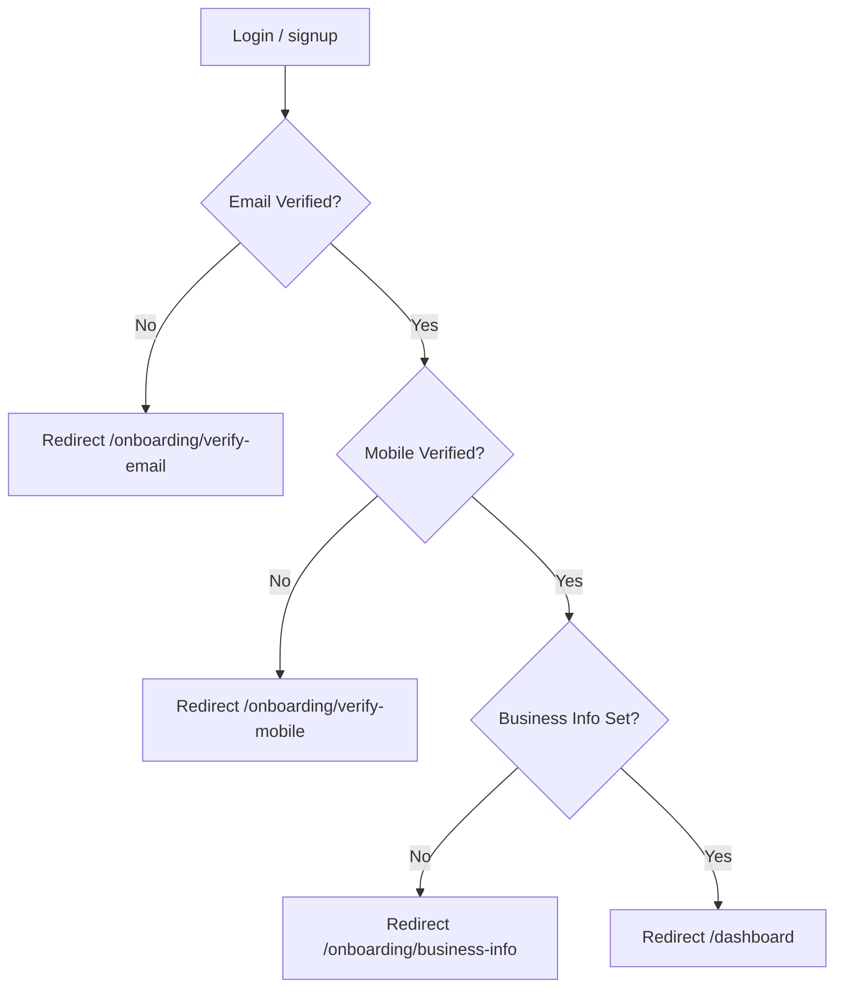

# Authentication & Onboarding Lifecycle

wApi implements a multi-stage onboarding process that ensures workspaces are fully configured before users access the main dashboard.

## 1. User Account Statuses

A user's `accountStatus` determines their capabilities and current step in the onboarding journey:
- `AWAITING_EMAIL_VERIFICATION`: User registered but hasn't verified their email OTP.
- `AWAITING_MOBILE_VERIFICATION`: Email is verified, but mobile OTP is pending.
- `AWAITING_BUSINESS_INFO`: Both verified, but business details (Name, Category, etc.) are missing.
- `SIGNUP_COMPLETED`: The user is ready for the dashboard.

## 2. Session Steering Logic

The `getNextOnboardingPath` function in `onboarding-state-service.ts` is the central "navigator" of the application. It is called by:
1. **Login API**: To tell the frontend where to redirect after a successful login.
2. **Session API**: To ensure a user reloading the page is sent back to the correct onboarding step.
3. **Middleware**: To block access to `/dashboard` if onboarding is incomplete.

## 3. Redirection Sequence

## 4. Auth Utilities

- **JWT Strategy**: Tokens are signed with a workspace-aware payload.
- **OTP Engine**: Generates 6-digit codes stored in Redis with a 10-minute TTL.
- **Password Hashing**: Uses `bcryptjs` with a cost factor of 10.
- **Session API**: `/api/auth/session` provides a unified view of the current user, their active workspace, and their `nextStep`.

## 5. Middleware Enforcement

The Next.js `middleware.ts` (or equivalent layout logic) protects routes by:
- Checking for the `auth_token` cookie.
- Validating the JWT.
- Forcing a redirect to the `nextStep` if the user tries to access `/dashboard` prematurely.
- Preventing authenticated users from accessing `/auth/login`.
