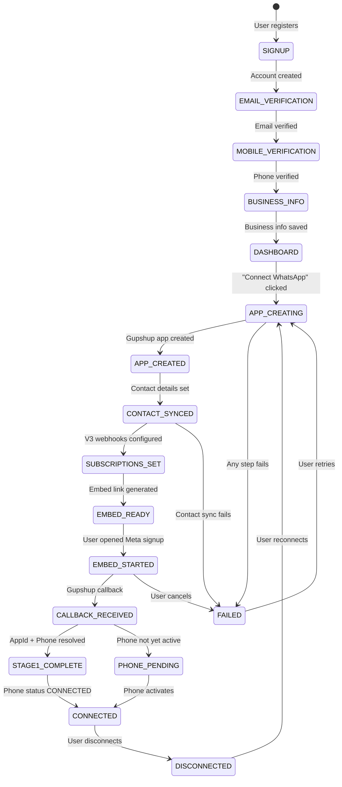

# Onboarding State Machine

The single source of truth for the entire user onboarding and BSP connection journey.

## Visualization

## State Mappings

### User.accountStatus Mapping

| `user.accountStatus` | `nextStep` Redirect |
|----------------------|---------------------|
| `AWAITING_EMAIL_VERIFICATION` | `/onboarding/verify-email` |
| `AWAITING_MOBILE_VERIFICATION` | `/onboarding/verify-mobile` |
| `AWAITING_BUSINESS_INFO` | `/onboarding/business-info` |
| `SIGNUP_COMPLETED` | `null` (→ dashboard) |

### Workspace.onboardingStatus Mapping

| `workspace.onboardingStatus` | Frontend Behavior |
|------------------------------|-------------------|
| `not_started` | Show "Connect WhatsApp" CTA |
| `ONBOARDING_STARTED` → `EMBED_GENERATED` | Provisioning in progress |
| `completed` | Full dashboard access |
| `disconnected` | Show reconnect CTA |
