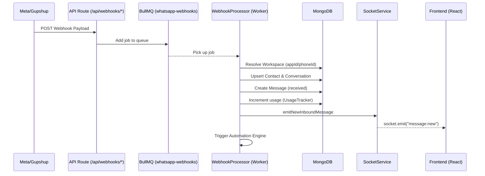
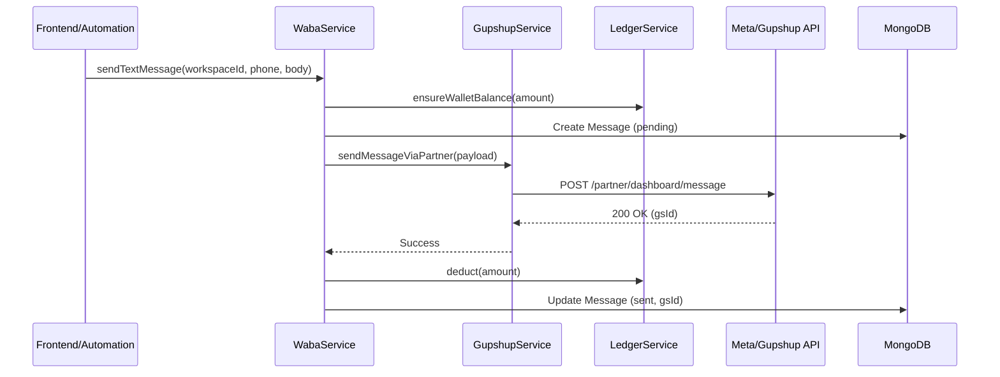

# Detailed Messaging Flow

This document explains the end-to-end journey of a message in wApi, from the external webhook to the real-time UI update, and the reverse path for outbound messages.

## 1. Inbound Message Flow (WhatsApp/Instagram/Facebook)

When a customer sends a message, the following sequence occurs:

### Key Components:
- **`src/dashboard/api/webhooks/gupshup/route.ts`**: The entry point. It does minimal processing and pushes to the queue to ensure fast response times (preventing webhook timeouts).
- **`src/lib/services/messaging/webhook-processor.ts`**: The core logic.
  - **Normalization**: Converts provider-specific payloads (Gupshup V3, Meta Cloud API) into a unified internal `Message` format.
  - **Deduplication**: Uses `whatsappMessageId` to prevent processing the same webhook twice.
  - **Media Handling**: Extracts media IDs and captions for images, videos, stickers, and documents.
  - **Rich Types**: Handles Interactive (buttons/lists), Flows (NFM), and Locations.
- **`src/lib/services/socket-service.ts`**: Uses `Socket.io` to broadcast the new message only to the relevant workspace and assigned agents.

---

## 2. Outbound Message Flow

When an agent or automation sends a message:

### Key Components:
- **`src/lib/services/messaging/waba-service.ts`**: High-level API for sending Text, Templates, Media, and Interactive messages. It handles the orchestration between the database, billing, and the partner gateway.
- **`src/lib/services/messaging/gupshup-service.ts`**: Handles the low-level HTTP requests to Gupshup, including authentication and response normalization.
- **`src/lib/services/billing/ledger-service.ts`**: Ensures the workspace has enough credits before allowing the message to be sent.

---

## 3. Message Status Updates

Status updates (Sent -> Delivered -> Read) follow a similar path to Inbound messages but call `processStatuses` instead of `processInbound`.

- **Funnel Tracking**: Status updates for campaign messages also update the `Campaign` model's aggregate statistics (`deliveredCount`, `readCount`, etc.) in real-time.
- **Batched Emission**: To prevent socket congestion during high-volume updates, statuses are batched before being emitted to the UI.
